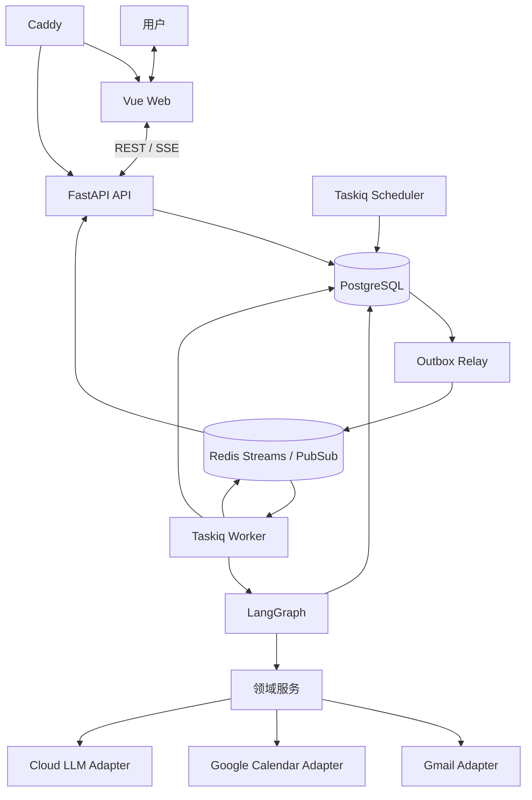
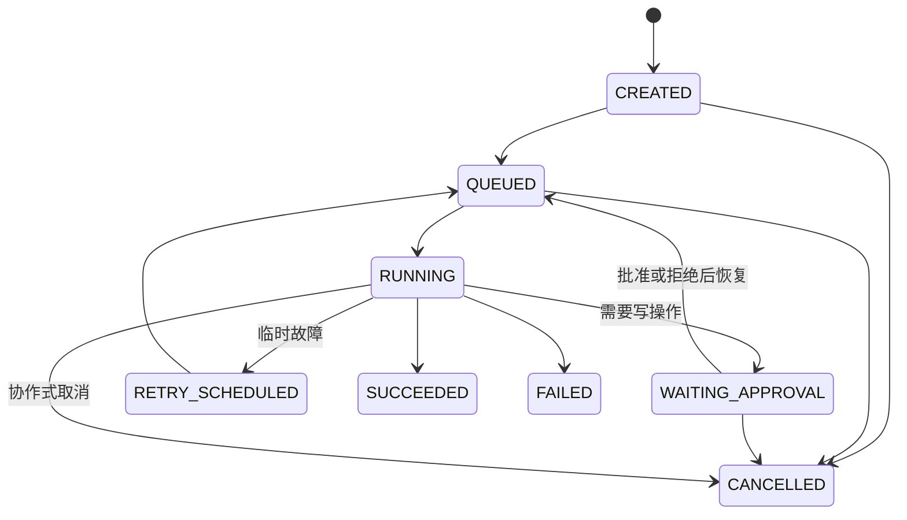
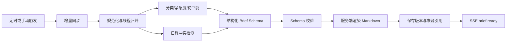

# AI Employee：可信任务中心与每日办公简报 MVP 设计

- 日期：2026-07-30
- 状态：设计已确认，等待书面规格复核
- 里程碑：M1
- 目标周期：单人全职 6～8 周

## 1. 背景与设计结论

AI Employee 是一个面向个人长期使用的智能办公助手。完整产品最终会覆盖邮件、日历、知识库、长期记忆、通用任务规划、工具平台与多 Agent 协作，但这些能力不会在一个巨型首版中同时实现。

本规格只详细定义第一个可独立交付的里程碑：以“每日办公简报”为首条业务闭环，先建立可信、可恢复、可审计的任务执行底座，再接入 Gmail 与 Google Calendar。

已经确认的核心决策如下：

| 决策项 | 结论 |
|---|---|
| 产品定位 | 单用户、可长期真实使用的个人 MVP |
| 首条验收场景 | 每日办公简报 |
| 执行权限 | 读操作自动执行；所有外部写操作必须人工确认 |
| 部署方式 | 单台云服务器，Docker Compose 持续运行 |
| 模型与隐私 | 混合模式：云端模型负责复杂推理，本地完成清洗与敏感信息预处理 |
| 用户模型 | 首版只服务一个用户，但所有数据保留 `user_id` 隔离 |
| 首批连接 | Gmail + Google Calendar；Outlook 延后 |
| 简报触发 | 每日定时自动生成，也允许用户手动刷新 |
| 第一阶段范围 | 任务中心、对话界面、Google 接入、每日简报、人工确认基础、执行记录 |
| 质量优先级 | 过程可信 > 集成可靠 > 交互体验 > 内容质量 |
| 总体架构 | 模块化单体 + 独立 API、Worker 与 Scheduler 进程 |

## 2. 范围

### 2.1 M1 包含

- 单管理员用户登录和安全 Cookie 会话。
- Google OAuth 连接、断开与连接状态管理。
- Gmail 与 Google Calendar 的只读增量同步。
- 每日办公简报的定时生成、手动刷新、历史版本与来源引用。
- 邮件线程级摘要、邮件类别、紧急度与待回复判断。
- 今日日程时间线和确定性冲突检测。
- ChatGPT 风格的对话入口、今日简报页、任务历史和执行时间线。
- 持久任务状态机、Taskiq Worker、LangGraph Checkpoint 和恢复执行。
- 人工审批数据结构与 UI 基础。M1 不执行真实外部写操作，但审批机制必须通过假工具测试，为 M2 做准备。
- SSE 实时进度、断线重放和数据库快照恢复。
- 审计、错误分类、基础指标、日志、备份与故障演练。
- `just` 统一开发、启动、迁移、测试和运维命令。

### 2.2 M1 不包含

- Outlook。
- 发送或回复邮件、创建或修改日程等真实外部写操作。
- 文件上传、Qdrant、RAG、知识问答和文档生成。
- 长期记忆与自动学习用户习惯。
- 通用 Planner、任意工具自动规划和复杂任务拆解。
- 多 Agent 协作。
- 多用户注册、租户管理、计费和 Kubernetes。
- 企业微信、Telegram、邮件等外部简报推送。

这些能力会作为独立里程碑分别设计，避免未来假设提前固化到 M1。

## 3. 总体架构

系统采用一个代码仓库中的模块化单体。模块共享领域模型和数据库，但以独立进程运行，从而兼顾单人开发效率和任务可靠性。



### 3.1 运行单元

- `web`：Vue 单页应用，生产构建后由 Caddy 提供静态文件。
- `api`：FastAPI，负责登录、OAuth、REST API、SSE、审批入口和资源查询。
- `worker`：Taskiq Worker，运行 LangGraph、同步任务和业务用例。
- `scheduler`：Taskiq Scheduler，运行固定频率的调度扫描、增量同步和维护入口。用户可配置的时区与简报时间保存在 PostgreSQL；Scheduler 每分钟查询到期计划并幂等创建任务，不把 Redis 中的动态计划当作真实来源。M1 的 Outbox relay 作为该进程中的维护循环运行，不增加独立容器。
- `postgres`：业务事实、任务状态、审计、Outbox 和 LangGraph Checkpoint 的真实来源。
- `redis`：Redis Streams 承载任务队列；Redis Pub/Sub 承载低延迟实时通知与文本增量；Redis 同时提供短期缓存和分布式协调。
- `caddy`：TLS、静态资源、反向代理和 SSE 连接转发。

### 3.2 关键边界

- FastAPI 请求进程不执行长任务。
- Redis 不是业务状态的真实来源。Redis 丢失后，可由 PostgreSQL 中的任务状态和 Outbox 重新投递。
- LangGraph 只负责任务编排、分支、中断和恢复，不承载全部业务规则。
- 邮件分类规则、冲突检测、审批策略和任务状态机属于可独立测试的领域层。
- 外部供应商 SDK 只能存在于适配器层，不能渗透到领域模型。

## 4. 仓库与模块结构

```text
AIEmployee/
├── frontend/
│   ├── src/
│   │   ├── api/
│   │   ├── components/
│   │   ├── features/
│   │   ├── pages/
│   │   ├── router/
│   │   └── stores/
│   └── tests/
├── backend/
│   ├── src/ai_employee/
│   │   ├── api/
│   │   ├── application/
│   │   ├── domain/
│   │   ├── agents/
│   │   ├── integrations/
│   │   ├── infrastructure/
│   │   ├── workers/
│   │   └── prompts/
│   └── tests/
├── justfiles/
│   ├── dev.just
│   ├── test.just
│   ├── db.just
│   ├── docker.just
│   └── ops.just
├── docs/
├── compose.yaml
├── compose.dev.yaml
└── justfile
```

依赖方向为：

```text
api / agents / integrations / workers
                  ↓
             application
                  ↓
               domain
```

`domain` 不导入 FastAPI、LangGraph、SQLAlchemy、Gmail SDK 或模型 SDK。`application` 定义用例和端口；外层模块实现端口。

## 5. 技术栈

### 5.1 前端

- Vue 3、TypeScript、Vite。
- Vue Router、Pinia。
- `markdown-it` 渲染 Markdown，DOMPurify 进行 HTML 清洗。
- Playwright 负责端到端测试，Vitest 与 Vue Test Utils 负责组件测试。
- `pnpm` 管理依赖和锁文件。

### 5.2 后端

- Python 3.12。
- FastAPI、Pydantic 2。
- SQLAlchemy 2、Alembic、asyncpg。
- LangGraph 1.x 和 `AsyncPostgresSaver`。
- Taskiq、`taskiq-redis` 的 `RedisStreamBroker`、SmartRetryMiddleware 与 TaskiqScheduler。
- `httpx` 调用外部 HTTP API。
- `uv` 管理 Python 环境、依赖和锁文件。

### 5.3 数据和部署

- PostgreSQL 作为业务与工作流持久化数据库。
- Redis Streams 作为任务投递通道；Redis Pub/Sub 作为实时事件通知通道。持久事件先写 PostgreSQL，Pub/Sub 只用于唤醒和低延迟推送。
- Docker Compose 部署。
- Caddy 自动管理 TLS。
- Qdrant 不进入 M1，在知识库里程碑再引入。

### 5.4 模型网关

后端定义供应商无关的 `ModelGateway` 端口。M1 实现一个兼容 OpenAI 风格 Chat Completions 和结构化 JSON 输出的云端适配器，具体 `base_url`、模型名和密钥由部署配置决定。

系统不会在运行时静默切换到另一个云供应商。主模型不可用时，简报进入部分成功或失败状态，避免在未告知用户的情况下改变数据流向。

本地预处理负责：

- 去除签名、引用历史、跟踪内容和无关 HTML。
- 识别并遮盖明显的密钥、验证码、访问令牌和用户配置的敏感模式。
- 只把完成当前分析所需的最小文本发送给云端模型。

M1 不强制引入 Presidio；其效果和误伤率会在后续隐私增强阶段单独评估。

## 6. 可信任务模型

### 6.1 任务状态



`TaskRun` 保存当前状态，`TaskStep` 保存节点级时间线。每次状态迁移同时产生 `AuditEvent` 和面向前端的持久事件。

### 6.2 持久化与恢复

- API 或 Scheduler 在同一个 PostgreSQL 事务中写入 `TaskRun` 和 `OutboxEvent`。
- Outbox relay 把 `task_id` 投递到 Redis Stream。
- Worker 收到消息后从 PostgreSQL 读取任务，获取有期限的执行租约并开始心跳。
- Worker 崩溃后，租约过期的任务可以重新投递。
- Taskiq 使用执行后确认；队列语义按至少一次处理。
- Worker 重复收到同一消息时必须安全退出或恢复同一任务，不能创建第二份业务事实。
- LangGraph 使用 `task_run_id` 作为主要 `thread_id`，并将 Checkpoint 保存到 PostgreSQL。

### 6.3 幂等与副作用

- 创建任务的 API 接受 `Idempotency-Key` 或 `client_request_id`。
- 每个外部工具执行拥有稳定的 `idempotency_key`。
- `ToolExecution` 保存供应商请求标识、执行状态和标准化结果。
- 任务队列、HTTP 重试和 LangGraph 节点恢复都可能导致重复调用，因此任何真实外部写工具都必须在 M2 进入系统前通过重复投递测试。

### 6.4 人工审批协议

虽然 M1 只读，但审批协议必须完整实现并用假写工具验证。

1. Agent 生成规范化操作提案，包括工具名、参数、风险等级和用户预览。
2. 服务端冻结操作载荷，计算 `payload_hash`，保存 `ApprovalRequest` 和 Checkpoint。
3. Task 状态变为 `WAITING_APPROVAL`。
4. 用户提交批准或拒绝时必须携带当前 `approval_version` 和 `payload_hash`。
5. 过期、重复、版本不一致或载荷不一致的决定返回冲突错误。
6. 批准后只能执行被批准的精确载荷。任何参数变化都必须产生新的审批。
7. 拒绝决定会恢复 Graph，并把“拒绝”作为明确结果交给后续节点；系统不得偷偷执行原操作。

LangGraph 的中断节点在恢复时可能重新执行，因此副作用必须放在批准节点之后，并保持独立、小粒度和幂等。

## 7. 每日办公简报

### 7.1 触发与版本

- 默认按用户时区每天 08:00 自动生成，用户可在设置中修改。
- 用户可以随时手动刷新。
- 自动任务使用 `user_id + local_date + schedule_kind` 防止重复生成。
- 手动刷新会创建同一日期的新版本，不覆盖旧版本。
- 默认展示最新成功或部分成功版本。
- “今日邮件”候选范围是用户本地日期零点到本次 `source_cutoff` 之间收到的消息；同一线程只生成一条聚合结果。
- “今日日程”包含与用户本地当天时间区间发生重叠的事件，而不只依据事件开始日期筛选。

### 7.2 增量同步

#### Gmail

- 首次连接只回溯最近 7 天。
- 后续约每 10 分钟基于 `historyId` 增量同步。
- 简报任务开始前强制检查同步新鲜度；数据过旧时先执行同步步骤。
- M1 只申请只读 scope。
- 原始 MIME 不持久化，附件不下载。
- `historyId` 失效时重新同步配置的 7 天窗口；供应商对象唯一约束确保重扫不会制造重复记录。

#### Google Calendar

- 首次同步当天至未来 7 天的事件。
- 后续使用 `syncToken` 增量同步。
- 保存事件 `etag`、状态、时区、重复事件标识和最后更新时间。
- M1 只申请只读 scope。
- `syncToken` 失效时重新同步当前窗口，并依靠唯一约束和 `etag` 合并结果。

M1 采用增量轮询，不引入 Gmail Pub/Sub 或 Calendar webhook 续租。对于单用户单机部署，这个方案更易测试和恢复。

### 7.3 邮件分析模型

“紧急”不是邮件类别，而是独立维度：

- `category`：`WORK`、`NOTIFICATION`、`SPAM`、`OTHER`。
- `urgency`：`URGENT`、`NORMAL`。
- `needs_reply`：布尔值。
- 可选结构化字段：截止时间、行动主体、原因码和置信度。

规则优先级如下：

1. Gmail 系统标签、邮件头、发件人规则等确定性信息。
2. 本地清洗和线程归并。
3. 云端模型处理仍然模糊的类别、紧急度、待回复判断和摘要。

系统按线程生成摘要，而不是对每封邮件单独重复总结。垃圾邮件只统计数量，不把正文发送给模型。通知邮件默认折叠汇总。

每次模型判断保存模型名、Prompt 版本、生成时间、结构化输出和输入哈希。完整敏感 Prompt 默认不写普通日志。

### 7.4 日程冲突

冲突由确定性领域服务计算，模型只负责解释：

- 忽略已取消事件。
- `free` 或透明事件不作为忙碌冲突。
- 有时间范围的忙碌事件发生重叠时标记冲突。
- 全天事件展示在简报中，但 M1 默认不与普通时间事件判定冲突。
- M1 不计算通勤时间缓冲。
- 所有计算先统一到 UTC，展示时转换到用户时区。

### 7.5 生成流程



模型先输出受 Pydantic Schema 约束的结构化数据，服务端再渲染 Markdown。模型不得直接控制最终 HTML。

### 7.6 简报内容

- 数据更新时间和完整性状态。
- 今日重点概览。
- 紧急邮件与截止事项。
- 需要回复的邮件线程。
- 工作邮件摘要。
- 折叠的通知邮件汇总。
- 垃圾邮件数量。
- 今日日程时间线。
- 冲突与准备提醒。
- 建议动作按钮。

每条重要结论必须包含 `source_ref`，可打开相应 Gmail 线程或 Calendar 事件。建议动作只创建新的任务；M1 不执行写操作。

### 7.7 部分失败

- Gmail 暂时失败时仍可生成日历部分。
- Calendar 暂时失败时仍可生成邮件部分。
- 页面必须显示缺失来源、最后成功同步时间和错误类型。
- 模型结构化输出失败时只进行一次修复重试；再次失败则保留确定性结果并生成部分简报。
- 系统不得把部分结果伪装成完整成功。

## 8. 数据模型

### 8.1 身份和连接

- `users`
- `user_sessions`
- `oauth_connections`
- `encrypted_credentials`
- `sync_cursors`

### 8.2 对话

- `conversations`
- `messages`

Message 区分用户、助手和系统角色，并保存与 `TaskRun` 的关联。文本增量只是实时体验，最终助手消息必须作为完整记录写入 PostgreSQL。

### 8.3 邮件和日历

- `email_threads`
- `email_messages`
- `email_analyses`
- `calendar_events`

供应商对象使用 `connection_id + provider_object_id` 唯一约束。所有用户拥有的数据都必须有非空 `user_id`，或通过拥有 `user_id` 的父实体进行强约束。

### 8.4 简报

- `daily_briefs`
- `daily_brief_items`

`daily_briefs` 保存日期、版本、完整性状态、生成任务、数据截止时间、结构化内容和 Markdown。`daily_brief_items` 保存章节、顺序、优先级、来源引用和建议动作。

### 8.5 任务与可信记录

- `task_runs`
- `task_steps`
- `approval_requests`
- `tool_executions`
- `audit_events`
- `outbox_events`
- `llm_invocations`

`audit_events` 按追加写设计。普通应用角色不更新或删除审计事件；数据保留任务使用单独权限批量清理到期分区或记录。

### 8.6 用户隔离

M1 由 Repository 强制注入 `user_id` 条件，并通过集成测试验证跨用户不可见。数据库模式和唯一约束从一开始携带 `user_id`，但 PostgreSQL RLS 延后到真正开放多用户时启用，避免在单用户首版中引入额外事务上下文复杂度。

## 9. 安全与隐私

### 9.1 登录

- M1 不开放注册。
- 部署时创建一个管理员用户。
- 密码使用 Argon2id 哈希。
- 会话使用 HttpOnly、Secure、SameSite Cookie。
- 修改类请求使用 CSRF 防护。
- 会话可以查看并撤销。

Google OAuth 只用于连接 Gmail 与 Calendar，不替代应用自身会话边界。

### 9.2 密钥与令牌

- 模型 API Key 和应用主密钥通过 Docker Secret 文件挂载，不进入数据库和 Git。
- OAuth Token 使用 AEAD 应用层加密，记录 nonce 和 `key_version`。
- 数据库磁盘使用云提供商的静态加密。
- 所有公网流量通过 TLS。
- 日志过滤 Token、Cookie、Authorization header、密钥和完整正文。

### 9.3 数据保留

默认值可由用户配置：

| 数据 | 默认周期 | 处理 |
|---|---:|---|
| OAuth 凭据 | 连接期间 | 断开时吊销并删除本地密文 |
| 原始 Gmail/Calendar 响应 | 不持久化 | 仅同步过程内存中处理 |
| 清洗后的邮件正文 | 30 天 | 加密保存，附件不下载 |
| 邮件元数据与结构化分析 | 180 天 | 用于简报历史和质量评估 |
| Calendar 描述、位置与事件快照 | 事件结束后 180 天 | 内容字段加密；未来事件保留到结束或删除 |
| 对话与消息 | 365 天 | 用户可主动删除单个会话 |
| 简报、任务与审计 | 365 天 | 到期后批量清理 |
| Redis 事件与临时结果 | 24 小时 | 可由 PostgreSQL 恢复 |

### 9.4 用户删除能力

- “断开 Google”：删除凭据并停止同步，不自动删除历史派生数据。
- “清除邮箱/日历缓存”：删除本地源数据、分析和由其产生的简报。
- “删除全部数据”：异步级联删除用户内容，只保留不含个人内容的删除操作审计。

## 10. API 与 SSE

### 10.1 API 约定

- 统一前缀：`/api/v1`。
- JSON 字段使用 `snake_case`。
- 错误响应使用 RFC 9457 Problem Details 风格，包含稳定 `error_code` 和 `trace_id`。
- 长任务创建返回 HTTP 202 和 `task_id`。

主要资源组：

- `/auth`
- `/connections`
- `/conversations`
- `/tasks`
- `/approvals`
- `/briefs`
- `/settings`
- `/system`

关键操作包括：

- 提交用户消息并创建任务。
- 获取任务快照、步骤和历史。
- 订阅任务 SSE。
- 取消或重试任务。
- 查询和决定审批。
- 获取、生成和刷新简报。
- 启动 Google OAuth、查看连接状态和断开连接。

### 10.2 SSE 协议

SSE 地址为 `GET /api/v1/tasks/{task_id}/events`，使用 Cookie 会话认证。

事件信封包含：

- SSE `id`。
- `event` 类型。
- `task_id`。
- 单调递增的 `sequence`。
- `occurred_at`。
- 可选 `step_id`。
- 类型化 `payload`。

持久事件包括：

- `task.snapshot`
- `task.status_changed`
- `step.started`
- `step.completed`
- `step.failed`
- `approval.required`
- `approval.resolved`
- `brief.ready`

临时事件包括：

- `assistant.delta`
- `heartbeat`

临时文本增量允许丢失，最终 AssistantMessage 必须持久化。客户端重连时使用 `Last-Event-ID` 请求遗漏事件；事件过期或间隙无法补齐时，客户端重新获取任务快照。客户端按 `sequence` 去重。

SSE 约每 15 秒发送心跳。Caddy 和 API 必须关闭会破坏实时性的响应缓冲。

## 11. 前端体验

桌面端采用三栏布局：

- 左栏：新对话、对话历史、今日简报、任务历史、设置与连接。
- 中栏：对话、Markdown 回答、来源引用、简报内容、建议动作和输入框。
- 右栏：可折叠执行时间线、步骤状态、耗时、错误和审批卡片。

移动端把左右栏转换为抽屉或独立页面。

前端必须支持：

- Markdown 安全渲染。
- 来源链接和数据更新时间。
- 任务状态与步骤时间线。
- SSE 断线提示与自动重连。
- 页面刷新后从服务器恢复完整状态。
- 部分成功警告和可操作错误。
- OAuth 连接状态和重新授权入口。

M1 不显示可用的文件上传入口，避免用户误以为知识库已经实现。

## 12. 错误处理

| 类型 | 自动重试 | 行为 |
|---|---|---|
| OAuth 失效、权限不足、审批过期 | 否 | 暂停或失败，向用户展示修复动作 |
| 429、5xx、网络超时 | 是 | 尊重 `Retry-After`，指数退避和 jitter |
| 资源不存在、永久 scope 缺失 | 否 | 标记连接 degraded，保存供应商错误码 |
| 模型 Schema 不合法 | 一次修复重试 | 再失败则生成部分结果 |
| 状态不变量和未知异常 | 默认否 | FAILED，向用户提供 trace_id，内部记录堆栈 |

默认临时错误最多自动尝试 3 次；具体工具可以根据供应商语义覆盖。所有节点和整项任务都有超时预算。

系统按 Gmail、Calendar、分析、生成分别记录步骤。单一来源失败不会删除已经成功的数据。

## 13. 可观测性

系统区分三类记录：

1. 用户时间线：自然语言步骤、状态、耗时、数据更新时间和修复动作。
2. 审计事件：操作者、审批、载荷哈希、工具执行、状态迁移和 trace_id。
3. 工程遥测：结构化 JSON 日志、Prometheus 指标和 OpenTelemetry Trace。

关键指标：

- 任务成功率、耗时、重试次数、队列等待和卡住任务。
- Gmail 与 Calendar 最后成功同步时间和同步延迟。
- 模型错误、Schema 修复率、token、估算成本和延迟。
- API 错误、SSE 连接、Worker 心跳、数据库与 Redis 健康。

如果配置的简报时间过去 15 分钟仍没有当天成功或部分成功简报，系统首页显示红色告警并创建诊断任务。

Prometheus 与 Grafana 作为可选 Docker Compose `observability` profile；M1 默认至少提供 `/metrics`、JSON 日志、健康检查和 Docker 日志轮转。

## 14. 测试策略

### 14.1 单元测试

- 任务状态机和审批规则。
- 邮件类别与紧急度确定性规则。
- 日程冲突检测、时区和夏令时边界。
- Outbox、幂等键和租约逻辑。
- LangGraph 路由与节点，使用 Fake Model 和 Fake Tools。
- Vue 组件、Pinia store 和事件 reducer。

### 14.2 集成与契约测试

- PostgreSQL、Alembic 和 Repository 用户隔离。
- Redis Streams、Taskiq 重试和重复投递。
- LangGraph PostgreSQL Checkpoint、中断与恢复。
- SSE 事件重放和数据库快照兜底。
- Gmail 与 Calendar 适配器使用脱敏固定 fixture 和 HTTP mock。
- OAuth Token 加密、刷新和失效路径。

CI 不依赖真实个人 Gmail 或 Calendar 账号。

### 14.3 E2E

Playwright 覆盖：

- 登录。
- 连接状态页面。
- 手动生成简报。
- 查看来源和任务时间线。
- SSE 断线与页面刷新恢复。
- 假写工具的批准、拒绝和过期审批。
- 错误与部分成功提示。

### 14.4 故障演练

- Worker 在节点中途终止。
- 同一队列消息重复投递。
- Redis 清空后由 Outbox 恢复。
- SSE 断线。
- OAuth Token 被撤销。
- Gmail 429 和 Calendar 5xx。
- 模型返回非法 JSON。

### 14.5 模型质量评估

维护一组脱敏或合成的邮件线程和日程样本，覆盖工作、通知、垃圾、紧急、非紧急、需回复和冲突场景。M1 不以任意拍定的准确率作为唯一发布门槛，而是：

- 保存当前基线结果。
- Prompt 或模型变更不得出现未解释的明显回归。
- 在真实数据试运行期间人工抽查紧急邮件、需回复判断和摘要事实一致性。
- 所有模型结论必须可追溯到来源，降低单纯依赖生成质量的风险。

## 15. 验收标准

### 15.1 功能

- 可以连接 Google 并完成 Gmail 与 Calendar 的只读增量同步。
- 可以按用户时区自动生成每日简报，也可手动刷新。
- 同一自动计划不会产生重复简报。
- 每条重要结论能跳转到来源。
- 单个来源失败时生成明确标记的部分简报。

### 15.2 可信执行

- 所有任务步骤和状态迁移可回放。
- 重复 HTTP 请求和队列投递不会创建重复业务结果。
- 页面刷新和 SSE 重连不会丢失持久事件。
- 审批载荷发生变化时原批准失效。
- 假写工具在批准前不执行，在拒绝后不执行。

### 15.3 可靠性

- 在不超过 200 封当日邮件和 20 个日历事件的测试数据下，简报 5 分钟内完成。
- Worker 崩溃后，任务能在租约过期后恢复。
- 连续 14 天真实试运行不出现重复生成或静默漏生成；外部供应商故障必须在界面中明确显示。

### 15.4 安全与运维

- Google OAuth scope 均为只读。
- 自动日志扫描不发现 Token、密钥或完整邮件正文。
- 完成一次加密 PostgreSQL 备份恢复演练。
- `just ci` 全部通过后才可发布。

## 16. `just` 开发入口

根 `justfile` 导入职责明确的子文件。默认命令显示分组后的 recipe 列表。

### 16.1 初始化与开发

- `just doctor`：检查 just、uv、pnpm、Docker、端口和必要环境变量。
- `just bootstrap`：安装前后端依赖。
- `just dev`：通过 Compose 启动完整开发环境。
- `just infra-up` / `just infra-down`：只管理 PostgreSQL 与 Redis。
- `just web`、`just api`、`just worker`、`just scheduler`：分别在前台启动进程。

### 16.2 测试与质量

- `just test`
- `just test-backend`
- `just test-frontend`
- `just test-integration`
- `just test-e2e`
- `just lint`
- `just format`
- `just typecheck`
- `just check`
- `just ci`

`just check` 执行格式检查、Lint、类型检查和快速单测；`just ci` 再加入集成测试、E2E 和生产构建。

### 16.3 数据库与运维

- `just db-upgrade`
- `just db-revision name`
- `just db-reset`
- `just logs service`
- `just ps`
- `just health`
- `just backup`
- `just restore file`

`db-reset` 和 `restore` 使用 just 的 `[confirm]` 属性，并在脚本内验证当前环境不是生产环境。justfile 不保存密码、Token 或私钥。

## 17. 部署、备份与发布

- 单台云服务器运行 Docker Compose。
- Caddy 对外暴露 80/443，其余服务仅在内部网络可见。
- PostgreSQL 和 Redis 使用持久卷。
- Redis 开启适合 Streams 的持久化，但恢复逻辑仍以 PostgreSQL 为准。
- 每天生成加密 PostgreSQL 备份，保留 7 个日备份和 4 个周备份。
- 备份复制到不同于 VPS 的存储位置。
- 每月执行一次恢复演练。
- 发布镜像按不可变版本标记；数据库迁移在应用启动前单独执行。
- 发布失败时回滚应用镜像；数据库迁移必须采用向前兼容策略，不依赖破坏性回滚。

## 18. 开源复用策略

截至 2026-07-30，推荐如下：

| 项目 | 许可证 | 使用方式 |
|---|---|---|
| [LangGraph](https://github.com/langchain-ai/langgraph) | MIT | M1 核心依赖 |
| [Agent Chat UI](https://github.com/langchain-ai/agent-chat-ui) | MIT | 参考 LangGraph 对话与流式 UX；因 React 技术栈不同，不 Fork |
| [Khoj](https://github.com/khoj-ai/khoj) | AGPL-3.0 | 参考个人 AI、自动化和知识库产品思路，不复制代码 |
| [Open WebUI](https://github.com/open-webui/open-webui) | 自定义许可证 | 只参考交互；存在品牌条款，不作为底座 |
| [Mem0](https://github.com/mem0ai/mem0) | Apache-2.0 | M4 长期记忆阶段与自研方案做对比实验 |
| [Langfuse](https://github.com/langfuse/langfuse) | 核心 MIT，部分 EE | M2 后评估 LLM Trace、Prompt 和评测；M1 先用 OTel |
| [Nango](https://github.com/NangoHQ/nango) | Elastic License 2.0 | 工具平台拥有多个 SaaS 连接后再评估 |
| [RAGFlow](https://github.com/infiniflow/ragflow) | Apache-2.0 | 参考完整 RAG 产品，不作为单机 M1 底座 |
| [Composio](https://github.com/ComposioHQ/composio) | MIT | M5 对大量工具接入做 Build-vs-Buy 比较 |

推荐原则：直接依赖小而清晰的基础库，借鉴成熟产品的交互和测试思路，但自己掌握 Task、Approval、Audit、数据模型和工具端口。

## 19. 6～8 周实施路线

| 周次 | 目标 | 完成标志 |
|---|---|---|
| 第 1 周 | 工程底座 | `just dev` 可启动；登录、迁移、CI、健康检查可用 |
| 第 2 周 | 可信任务内核 | 假任务可经 Queue、LangGraph、SSE 完成；可恢复和审计 |
| 第 3 周 | Google 接入 | OAuth、加密凭据、Gmail/Calendar 增量同步通过契约测试 |
| 第 4 周 | 简报引擎 | 分类、摘要、冲突、Schema、来源和部分失败闭环完成 |
| 第 5 周 | 用户体验 | 对话、简报、任务时间线、历史、设置和错误体验完成 |
| 第 6 周 | 加固部署 | 故障演练、TLS、备份恢复、安全检查和指标完成 |
| 第 7 周 | 真实数据试运行 | 开始连续 14 天观察，执行 Prompt 与成本评估 |
| 第 8 周 | 发布缓冲 | 修复试运行问题、冻结版本、完成文档和稳定发布 |

每周都必须保持 `just check` 通过；从第 2 周开始持续维护端到端纵向切片，避免最后才进行系统集成。

## 20. 后续里程碑

### M2：可执行邮件与日历助手

- 邮件草稿、人工批准后发送。
- 日程创建、修改和冲突修改建议。
- Outlook 接入。
- 更完整的权限分级、撤销和补偿策略。

### M3：知识库与 RAG

- 文件上传与解析。
- Qdrant、切片、Embedding、版本和删除传播。
- 知识问答、引用和基于资料的文档生成。

### M4：长期记忆

- 显式用户档案。
- 偏好候选、证据、置信度、用户确认和撤销。
- 比较自研结构化记忆、LangGraph Store 和 Mem0。

### M5：通用 Planner 与工具平台

- 统一 Tool Manifest、参数 Schema、权限、风险和幂等策略。
- Planner、任务队列与执行器的通用复杂任务闭环。
- Web Search、文件系统、数据库等工具。
- 评估 Nango 或 Composio 等外部集成平台。

### M6：多 Agent

多 Agent 不是早期产品目标。只有在单 Graph 出现明确的上下文隔离、专业能力、并行性或维护瓶颈时，才把稳定子图拆成专业 Agent。是否引入 Supervisor、消息协议和独立运行时必须由可测量收益决定。

## 21. 主要风险与控制

| 风险 | 控制 |
|---|---|
| OAuth 和 Google API 联调耗时 | 第 3 周前完成云项目、回调域名和测试账号准备；用 fixture 保证 CI 稳定 |
| 模型摘要产生事实错误 | 结构化输出、来源引用、规则优先、线程级输入和人工抽查 |
| Taskiq 生态小于 Celery | Queue Port 隔离；PostgreSQL 保存真实状态；用重复投递和恢复测试验证 |
| Redis 丢失任务 | Transactional Outbox 重新投递；任务结果不依赖 Redis 保存 |
| 邮件内容隐私 | 只读最小权限、本地清洗、短期加密正文、日志脱敏、可配置删除 |
| 一人开发范围失控 | M1 严格排除 RAG、记忆、Outlook、真实写工具和多 Agent |
| 多 Agent 过早复杂化 | 先交付单 Graph 可测闭环，后续按实际瓶颈拆分 |

## 22. 设计完成条件

本规格已经明确 M1 的产品边界、架构、状态模型、数据流、数据实体、安全策略、API/SSE、前端体验、错误处理、测试、验收、开发命令、部署和实施路线。

进入实施计划前，用户需要复核本文件。任何会改变 M1 范围、任务可信模型、数据保留、Google 权限或核心技术栈的修改，都应先更新本规格再编写实施计划。
