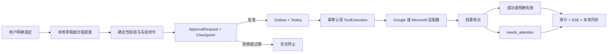

# AI Employee M2：可执行邮件与日历助手设计

> 日期：2026-08-06
>
> 状态：已批准
>
> 前置里程碑：M1「可信任务中心 + 每日办公简报」

## 1. 背景与设计结论

M1 已建立单管理员登录、Google 只读同步、每日简报、持久任务、人工审批、
LangGraph Checkpoint、Taskiq、Outbox、SSE、审计和故障恢复底座。M2 在不改变这些可信
执行不变量的前提下，引入真实邮件和日历写操作，并把 Google 与 Microsoft 作为一次完整
里程碑统一交付。

M2 的产品定位仍是「助手工作台」，不是新的邮箱或日历客户端。系统可以在对话和简报中
提出行动建议，但只有用户明确点击或下达命令后，才会创建可编辑提案和人工审批。任何真实
外部写入都必须绑定一个类型化命令、一个冻结版本、一个审批决定和一个幂等工具执行事实。

设计结论如下：

- M2 一次发布 Google 和 Microsoft 邮件、日历能力，不拆分对外发布版本。
- 采用仅面向邮件和日历的供应商无关「可信操作内核」，不引入通用 Planner 或工具平台。
- 邮件草稿只在本地加密保存，批准后直接发送；不写入供应商草稿箱。
- 每项审批只授权一个精确外部操作，有效决定窗口为 10 分钟。
- 审批使用当前安全 Cookie 会话和 CSRF，不增加密码二次验证。
- 日程修改使用供应商版本条件，补偿永远是需要新审批的新操作。
- 外部调用采用「至多产生一次业务副作用、结果必须核对」策略；只有能够证明先前写入未应用时
  才能重试调用，不确定结果不得盲目重放。
- Google 和 Microsoft 使用最小、按能力渐进取得的 OAuth 委托权限。
- M2 仍是单管理员产品，不增加多用户、租户或企业权限体系。

## 2. 范围

### 2.1 M2 包含

- Google Gmail 与 Microsoft Graph 邮件的新建、回复和全部回复。
- 本地加密邮件草稿、不可变草稿版本、编辑冲突和 10 分钟审批。
- Google Calendar 与 Microsoft Graph Calendar 非重复日程的创建和修改。
- 日程标题、时间、时区、描述、地点、参会人及邀请通知策略。
- 基于用户全部已连接日历、统一工作时间和会议缓冲的确定性冲突建议。
- 日程修改前快照，以及需要再次审批的显式恢复操作。
- Microsoft 个人账户和 Microsoft 365 工作/学校账户；不支持本地 Exchange。
- 按连接区分 `mail.read`、`mail.send`、`calendar.read`、`calendar.write` 的渐进授权。
- 连接级默认发送账户、默认日历、每周工作时间和会议缓冲设置。
- 统一操作中心、结构化审批预览、结果核对、人工结果确认和完整执行时间线。
- Microsoft 邮件、日历只读增量同步，与现有 Google 规范化模型对齐。
- Google 与 Microsoft 日历目录同步，以及每个可见日历的权限、时区和独立增量游标。
- 真实写入的幂等认领、结果核对、未知结果安全停机、审计和运维开关。

### 2.2 M2 不包含

- 供应商草稿箱同步或把未批准草稿写入 Gmail、Outlook。
- 邮件转发、附件、原始 MIME 持久化、HTML 邮件或富文本编辑器。
- Google Contacts、Microsoft Contacts 或其他通讯录同步。
- 批量邮件发送、批量日程修改或时间段授权。
- 日程删除、取消、重复日程创建或编辑、会议链接自动创建。
- 查询参会人的 Free/Busy；冲突建议只说明当前用户自己的可用性。
- 完整收件箱、邮件搜索产品、完整日历网格或供应商客户端替代品。
- Outlook 本地 Exchange、共享邮箱、Microsoft 365 Group Calendar 或应用权限访问。
- Gmail Send As 别名、Microsoft 代理发送、共享发件地址或跨邮箱委托发送。
- 文件上传、Qdrant、RAG、长期记忆、通用 Planner、工具市场、多 Agent、多用户注册或
  Kubernetes。

### 2.3 M2 发布边界

M2 必须在同一个发布版本中提供 Google 与 Microsoft 的核心能力对等。内部开发可以按可信
操作内核、Google 适配器、Microsoft 适配器和前端体验分阶段落地，但不能把只完成单一供应商
描述为 M2 发布完成。

M2 开始实施前应将根 `AGENTS.md`、README 和验收文档中的「当前只实现 M1」表述更新为
已批准的 M2 范围。该文档同步不重新打开 M1 功能范围，也不能把尚无证据的 M1 验收项标记为
已通过。

## 3. 用户控制模型

### 3.1 受控混合发起

允许以下入口生成建议：

- 每日简报中的「准备回复」或「建议调整日程」。
- 对话中的明确自然语言请求。
- 操作中心中的新邮件和新日程按钮。
- 邮件线程或日程来源详情中的显式操作按钮。

建议本身不是审批请求，也不能让任务进入 `WAITING_APPROVAL`。只有用户明确点击「准备草稿」
「创建提案」或提交自然语言命令后，应用层才创建本地草稿或日程提案。用户完成编辑并点击
「提交审批」后，系统才冻结精确命令。

### 3.2 单操作审批

一次审批只能包含以下一种操作：

- 发送一封邮件。
- 创建一个日程。
- 修改一个日程。
- 恢复一个日程到先前状态。

不允许一个审批包含多封邮件、多个日程或未来一段时间的概括授权。一个邮件可以包含多个
收件人，但总收件人数量不得超过 50 个去重地址；一个日程的参会人不得超过 50 个去重地址。
这些上限用于阻止 M2 演变为批量外联工具。

### 3.3 多账户选择

- 回复和全部回复必须绑定原始邮件连接，不能跨账户发送。
- 日程修改和恢复必须绑定原始日历连接与日历 ID。
- 新邮件使用用户默认发送账户，冻结前允许显式切换。
- 新日程使用用户默认日历，冻结前允许显式切换。
- 冻结命令必须包含精确 `connection_id` 和目标日历，执行时不得重新自动选择。
- 默认连接或默认日历已禁用、断开或失去写权限时，创建操作必须要求用户重新选择；禁止静默
  回退到另一个账户或 primary calendar。

## 4. 总体架构

M2 延续模块化单体和独立运行单元：

- FastAPI API：认证、授权、Schema、短事务和 HTTP 202 接受。
- Taskiq Worker：长任务、供应商调用、核对和补偿执行。
- Scheduler：到期审批、重试、核对扫描、保留清理和同步计划。
- PostgreSQL：连接、草稿、提案、任务、审批、工具执行、审计、Outbox 和 Checkpoint 的唯一
  真实来源。
- Redis：队列、通知、短期缓存和协调；丢失后必须从 PostgreSQL 恢复。

依赖方向保持不变：

```text
api / agents / integrations / workers
                  ↓
             application
                  ↓
               domain
```

可信操作数据流如下：



## 5. 模块与职责

### 5.1 Connections

负责：

- Google 与 Microsoft OAuth 生命周期。
- 供应商账户身份规范化。
- 实际 scope 与本地能力状态。
- 默认发送账户和默认日历。
- 能力启用、关闭和整个连接断开。

该模块不执行邮件或日历业务规则。

### 5.2 Mail

负责：

- 本地加密草稿和不可变版本。
- 新邮件、回复、全部回复的地址与线程规则。
- 纯文本正文和模型最小披露。
- 构建 `MailSendCommand`。

模型只生成正文候选，不能决定发件账户、收件人、主题、回复线程或是否发送。

### 5.3 Calendar

负责：

- 日程创建、修改和恢复提案。
- 用户本人冲突检测与候选时间生成。
- ETag、通知策略和补偿快照。
- 构建 `CalendarCreateCommand`、`CalendarUpdateCommand` 和
  `CalendarRestoreCommand`。

模型只能解释冲突与建议，不能决定候选时间是否合法。

### 5.4 Trusted Actions

负责：

- 类型化命令验证与规范序列化。
- 冻结命令、AEAD 加密和哈希绑定。
- 人工审批中断与恢复。
- 工具执行认领、结果核对和人工结果确认。
- 任务、步骤、审计、Outbox、Checkpoint 和 SSE 的一致状态变化。

该模块只接受邮件和日历命令联合，不提供任意 Tool Manifest 或动态工具注册。

### 5.5 Provider Adapters

Google 与 Microsoft 适配器分别负责：

- OAuth URL、Token 交换、刷新和撤销。
- 只读增量同步。
- 邮件发送和回复。
- 日程创建、更新及结果核对。
- 供应商错误到内部错误类别的映射。

供应商 SDK、HTTP 字段和原始响应不得离开适配器边界。

## 6. 类型化命令

### 6.1 通用要求

所有命令必须：

- 使用固定英文 `action` 和显式 `schema_version`。
- 只包含标准 JSON 类型，时间使用带时区 RFC 3339，业务日期携带 IANA 时区。
- 包含精确 `connection_id`，不得只依赖账户邮箱。
- 包含稳定 `operation_id`，供幂等、核对和供应商关联使用。
- 在进入领域层前完成 Pydantic 边界验证，再映射为不可变领域值对象。
- 规范化后计算 SHA-256；动作名、Schema 版本和完整载荷都进入哈希。

### 6.2 `MailSendCommand`

字段至少包括：

| 字段 | 约束 |
|---|---|
| `schema_version` | 固定为 `mail_send.v1` |
| `action` | 固定为 `mail.send` |
| `operation_id` | 稳定 UUID |
| `connection_id` | 已启用 `mail.send` 的连接 |
| `draft_id` / `draft_version` | 已冻结的本地草稿版本 |
| `mode` | `new`、`reply` 或 `reply_all` |
| `source_thread_id` | 回复类必填，新邮件为空 |
| `source_message_id` | 回复类必填，新邮件为空 |
| `to` / `cc` / `bcc` | 规范化、去重地址；合计不超过 50 |
| `subject` | 用户可见纯文本主题，最大 255 个 Unicode 字符 |
| `body_text` | 纯文本，最大 100,000 个 Unicode 字符 |
| `thread_headers` | 回复所需的内部规范化引用，不接受用户任意原始 Header |

发件地址从连接事实确定，不能由用户或模型在命令中伪造。地址去重忽略域名大小写，并按供应商
规范保留本地部分；系统不擅自执行 Gmail 点号或加号地址归并。

### 6.3 `CalendarCreateCommand`

字段至少包括：

| 字段 | 约束 |
|---|---|
| `schema_version` | 固定为 `calendar_create.v1` |
| `action` | 固定为 `calendar.create` |
| `operation_id` | 稳定 UUID |
| `connection_id` / `calendar_id` | 精确目标 |
| `client_event_id` | 供应商允许时使用的稳定创建标识 |
| `title` | 必填纯文本 |
| `description` / `location` | 可空纯文本 |
| `starts_at` / `ends_at` | 明确 UTC 瞬间或全天日期 |
| `timezone` | IANA 时区 |
| `all_day` | 显式布尔值 |
| `attendees` | 规范化去重地址，不超过 50 |
| `notification_policy` | `all` 或 `none` |

不允许 recurrence、conference、attachments 或任意供应商扩展字段。

### 6.4 `CalendarUpdateCommand`

在创建命令字段基础上增加：

- `provider_event_id`：目标供应商事件 ID。
- `base_etag`：生成提案时的供应商版本。
- `before_snapshot_id`：加密修改前快照。
- `changed_fields`：确定性生成的字段名集合，仅用于预览和审计，不代替完整期望状态。

执行时必须用 `base_etag` 做条件更新。供应商当前版本不同则不执行写入。

### 6.5 `CalendarRestoreCommand`

恢复命令由历史 `before_snapshot` 生成，但必须：

- 读取当前供应商事件并取得新的 `base_etag`。
- 显示当前状态与待恢复状态的完整差异。
- 冻结新的通知策略。
- 生成新的 `operation_id`、ApprovalRequest 和 ToolExecution。

恢复不能复用旧审批，也不能绕过当前能力状态。

## 7. 状态模型

### 7.1 草稿和提案

邮件草稿状态：

```text
editing → awaiting_approval → executing → sent
   ↓             ↓          ↙          ↘
cancelled      editing   editing   needs_attention
```

- `editing`：允许基于当前版本继续编辑。
- `awaiting_approval`：某一不可变版本已生成审批，草稿被锁定；继续编辑必须先撤回审批。
- `executing`：审批已通过且 Worker 已认领，不能再取消或编辑冻结版本。
- `sent`：对应发送命令已确认成功。
- `cancelled`：用户删除本地草稿，没有外部副作用。
- `needs_attention`：发送结果未知；只能核对或人工确认，不能编辑后直接重发。

拒绝、过期或显式撤回会使草稿返回 `editing`。此后首次保存产生新版本；旧 ApprovalRequest
状态变为 `invalidated`，其冻结版本永久不可再次批准。明确确认邮件未发送后，用户也必须先
产生新草稿版本并重新审批。

日程提案使用 `editing`、`awaiting_approval`、`executing`、`applied`、`stale`、
`needs_attention` 和 `cancelled`。ETag 冲突会进入 `stale`，必须基于供应商最新事件重新生成
版本，旧提案不能继续执行。

ApprovalRequest 在 M1 状态基础上增加 `invalidated`，仅用于草稿或提案版本变化、能力关闭、
连接断开或执行认领截止时间到期。`invalidated` 是终态，不能改回 pending。

### 7.2 TaskRun

M2 在 M1 状态基础上增加：

- `reconciling`：供应商可能已接收写请求，系统只执行只读核对。
- `needs_attention`：自动核对无法确定结果，禁止继续写入。

主要迁移：

```text
running → waiting_approval → queued → running
running → retry_scheduled → queued
running → reconciling → succeeded
running → reconciling → failed
running → reconciling → needs_attention
needs_attention → reconciling
needs_attention → succeeded
needs_attention → failed
```

`needs_attention → succeeded/failed` 只允许经过用户人工结果确认用例，并追加明确 actor、时间和
确认来源。它不能重新调用供应商。

### 7.3 ToolExecution

工具执行状态：

```text
claimed → executing → succeeded
                    → confirmed_failed
                    → retryable_failed → executing
                    → reconciling → succeeded
                                  → confirmed_failed
                                  → needs_attention
```

- `claimed` 已阻止第二个 Worker 创建同一执行事实。
- `executing` 表示请求即将发送或正在发送，不能据此推断供应商结果。
- `retryable_failed` 只用于适配器能够证明供应商未接受写入的失败。
- `reconciling` 和 `needs_attention` 期间不得重发写请求。

## 8. 审批协议

### 8.1 冻结与存储

真实命令不得明文存入 `ApprovalRequest.payload`。ApprovalRequest 扩展为：

- `action`、`schema_version`、风险等级和不含敏感内容的预览元数据。
- 完整规范命令的 AEAD `ciphertext`、`nonce` 和 `key_version`。
- 规范明文命令的 `payload_hash`。
- 草稿或日程提案 ID 与版本。
- `expires_at`、`approved_execution_deadline_at` 和现有决定字段。

审批预览和 Worker 执行时才在受控内存中解密完整命令。日志、SSE、审计和普通错误不得输出
解密命令。

### 8.2 决定规则

- 待审批决定窗口为创建后 10 分钟。
- 当前有效登录会话和 CSRF 即可决定，不要求密码二次验证。
- 决定必须携带当前 `version` 和 `payload_hash`。
- 编辑已提交草稿或提案必须先使旧审批失效，再产生新版本。
- 已批准操作必须在批准后 5 分钟内由 Worker 完成幂等认领；超时则安全失败并要求重新审批。
- 认领后即使超过执行截止时间，也必须完成结果核对，不能把可能已执行的调用当作未执行。
- 连接断开、能力关闭或载荷变化会阻止尚未认领的操作。

### 8.3 审批预览

邮件预览必须展示：

- 供应商、账户、全部 To/CC/BCC。
- 新邮件、回复或全部回复模式。
- 完整主题和纯文本正文。
- 不可撤销提示、版本、到期时间和风险等级。

日程预览必须展示：

- 供应商、账户、目标日历。
- 创建、修改或恢复类型。
- 修改前后字段差异、时区、参会人和通知策略。
- 当前检测到的冲突、ETag 版本和可补偿性说明。

前端不能只显示原始 JSON。

### 8.4 风险等级

M2 风险等级只影响预览、审计和指标，不改变「每次写入都要审批」的规则：

- `high`：所有邮件发送；带参会人或发送通知的日程创建、修改和恢复。
- `medium`：不含参会人且 `notification_policy=none` 的个人日程创建、修改和恢复。

M2 没有可以免审批的低风险外部写操作。用户已选择不进行密码二次验证，因此两类风险都使用
当前安全会话、CSRF、10 分钟决定窗口和精确载荷校验。

## 9. 邮件助手

### 9.1 草稿生成

模型输入只包含：

- 用户本次指令。
- M1 已有线程摘要。
- 最近最多 3 封与回复直接相关的已清洗正文。
- 清洗后正文合计最多 12,000 个 Unicode 字符。
- 明确的语气、语言和长度要求。

模型输入继续删除签名、历史重复引用、跟踪内容和明显敏感模式。垃圾邮件正文不发送给模型。
Prompt 使用版本文件 `mail_draft_v1.md`，模型输出只包含正文候选；地址、主题和线程字段由应用层
确定性处理。

模型不可用或输出验证失败时，用户仍可创建空白本地草稿并手工编辑。系统不得把模型失败伪装成
发送失败。

### 9.2 草稿编辑

- 正文仅支持纯文本和换行，不解释 Markdown 或 HTML。
- 每次成功保存生成单调递增版本。
- PATCH 必须携带当前版本，陈旧版本返回 409。
- 自动补全只使用本地已同步历史参与者，不调用供应商 Contacts API。
- 用户可以输入任意语法合法地址；地址验证失败时不能提交审批。
- 回复和全部回复的原始线程、发送连接和确定性回复主题不可改变；需要更改主题时必须转换为
  新邮件。
- 发件地址固定为连接主账户；不解析或使用 Gmail Send As、Microsoft 代理发送或共享邮箱别名。
- 回复全部默认排除用户自己的连接地址并对地址去重，用户冻结前可以调整 To/CC/BCC。

### 9.3 Gmail 发送

- 使用 `gmail.send` scope 和 `users.messages.send`。
- 生成 RFC 2822 纯文本 MIME，并进行 Base64URL 编码。
- 回复必须提供原始 `threadId`、匹配主题，以及符合 RFC 2822 的 `In-Reply-To` 和
  `References`。
- 不调用 Gmail Draft API。
- 使用稳定 Message-ID 或等价关联信息进行 Sent 结果核对；若供应商无法证明结果，进入
  `needs_attention`。

### 9.4 Microsoft Graph 发送

- 使用委托 `Mail.Send`，不为本地草稿申请 `Mail.ReadWrite`。
- 新邮件使用直接发送接口；回复和全部回复使用对应的直接发送语义。
- 正文 ContentType 固定为 Text，并保存到 Sent Items。
- 使用 Graph 请求标识、支持的自定义关联信息和 Sent Items 只读查询进行核对。
- 若直接回复接口不能无损表达冻结命令，适配器必须在审批前拒绝，不得创建隐藏供应商草稿或
  丢弃收件人字段。

### 9.5 邮件结果

成功结果至少保存：

- 供应商消息 ID、线程或会话 ID。
- 供应商请求关联标识。
- 发送确认时间。
- 不含正文和完整地址的结果摘要。
- 可打开的供应商 Sent Items 链接；无法生成时明确为空。

邮件发送成功后不可补偿。界面不得提供「撤回」或暗示可撤回的按钮。

## 10. 日历助手

### 10.1 工作时间与冲突建议

用户设置新增：

- 每周工作时间：一周中的每一天可包含零个或多个不重叠时间段。
- 工作时区：复用用户 IANA 时区。
- 会议缓冲：0～120 分钟，默认 10 分钟。

迁移默认工作时间为周一至周五 09:00～18:00。用户修改后立即用于新建议，不追溯修改已冻结
提案。

确定性建议算法：

1. 读取用户全部已连接且同步新鲜的日历事件。
2. 把事件按用户 IANA 时区映射到工作时间。
3. 在事件前后加入配置的缓冲。
4. 按 15 分钟网格搜索未来 14 天。
5. 返回最多 3 个满足原始时长的候选时间。
6. 不查询参会人 Free/Busy，也不声称参会人可用。

若任一连接同步陈旧或失败，候选结果必须标记完整性为 partial，并展示缺失账户。模型只生成
解释文字，不能修改候选时间。

### 10.2 创建日程

- 支持定时和全天非重复事件。
- 有参会人的事件默认 `notification_policy=all`。
- 无参会人的个人事件默认 `notification_policy=none`。
- 用户冻结前可以显式更改通知策略。
- Google `sendUpdates=none` 可能影响外部日历同步，审批预览必须显示供应商警告。
- 创建使用稳定 `operation_id` 映射到供应商支持的事件关联标识，降低重复 POST 风险。
- 目标日历必须来自已同步日历目录，且供应商访问角色明确允许创建事件。

### 10.3 修改日程

- 只允许修改非重复事件；发现 recurring master 或 instance 时返回稳定不支持错误。
- 提案生成时保存 `base_etag` 和加密 before snapshot。
- 目标事件和日历必须在供应商目录中明确标记为当前账户可修改。
- 执行前读取当前事件并比较版本；不同则返回冲突，不调用更新接口。
- 时间、地点或参会人变化默认发送更新通知；纯个人字段变化默认不发送，冻结前可调整。
- 更新必须提交完整期望状态或供应商安全 Patch，不能依赖未展示的供应商默认值。

### 10.4 恢复日程

恢复是新提案而不是数据库回滚：

1. 读取历史修改前快照。
2. 读取供应商当前事件与 ETag。
3. 计算当前状态到历史状态的差异。
4. 用户确认通知策略并提交新审批。
5. 使用新 ETag 条件更新。

若事件已删除、成为重复事件或用户不再拥有修改权限，恢复提案不可执行并显示明确原因。

## 11. OAuth、连接与权限

### 11.1 能力模型

每个连接为下列能力保存独立状态：

- `mail.read`
- `mail.send`
- `calendar.read`
- `calendar.write`

能力状态为：

- `disabled`：用户未启用或已本地关闭。
- `authorizing`：正在进行渐进 OAuth。
- `enabled`：本地启用且最近一次验证存在所需 scope。
- `degraded`：Token 可用但供应商调用持续失败。
- `action_required`：需要重新授权或管理员同意。
- `revoked`：供应商明确撤销。

创建提案、提交审批和 Worker 执行三个边界都必须检查能力；前端隐藏按钮不是授权。

能力依赖固定为：

- `mail.send` 依赖 `mail.read`，因为回复线程绑定和 Sent 结果核对需要读取能力。
- `calendar.write` 依赖 `calendar.read`，因为冲突、ETag 和写后核对需要读取能力。
- 对应写能力启用期间不能单独关闭其读取能力；必须先关闭写能力。

### 11.2 Google scope

基础身份：

- `openid`
- `email`

邮件读取能力：

- `https://www.googleapis.com/auth/gmail.readonly`

日历读取能力：

- `https://www.googleapis.com/auth/calendar.readonly`

邮件发送能力追加：

- `https://www.googleapis.com/auth/gmail.send`

日历写能力追加：

- `https://www.googleapis.com/auth/calendar.events`

### 11.3 Microsoft delegated scope

基础身份和离线访问：

- `openid`
- `profile`
- `email`
- `User.Read`：Microsoft Graph `/me` 获取当前用户稳定 ID 和邮箱地址所需的最小
  delegated permission；个人账户与工作/学校账户均适用。
- `offline_access`

读取能力：

- `Mail.Read`
- `Calendars.Read`

邮件发送能力：

- `Mail.Send`

日历写能力：

- `Calendars.ReadWrite`

Microsoft OAuth 使用允许个人 Microsoft 账户和工作/学校账户的端点。`User.Read` 仅用于
Graph `/me` 的当前用户身份投影，不是目录权限或应用权限；不得借此申请 Contacts、
`Mail.ReadWrite` 或任何超出 M2 写动作边界的权限。连接唯一身份由供应商、tenant/account
类型和 Graph 用户 ID 共同规范化，不能只使用邮箱。

Trusted Action 允许列表与认领边界使用供应商固定为小写 `google` 或 `microsoft` 的精确三段
canonical key：
`provider:encoded_tenant:encoded_account`。Google 的 tenant 是空段，形成
`google::<encoded_account>`；Microsoft 保留现有 `provider_account_id=<tenant>:<graph_user_id>`
持久格式，但 canonical key 去除重复 tenant，形成
`microsoft:<encoded_tenant>:<encoded_graph_user_id>`。这只是物理编码，逻辑身份仍是供应商、
tenant 与稳定 provider account ID 三部分。

tenant/account 都按 opaque 文本处理：RFC 3986 unreserved 字符
`A-Z a-z 0-9 - . _ ~` 保持原样，其他字符先编码为 UTF-8 字节，再使用大写 `%HH`。因此普通
合成键仍保持 `google::synthetic-account` 或
`microsoft:synthetic-tenant:synthetic-graph-user`，而 `@`、`:`、`%` 与非 ASCII 字符必须编码。
每个解码后的 raw component 最长 255 个 Unicode 字符，每个 encoded segment 最长 3060 个
ASCII 字符，以覆盖 255 个四字节 Unicode 字符。Microsoft 现有
`<tenant>:<graph_user_id>` 持久复合值总长仍不得超过 255，内嵌 tenant 必须一致；Graph 用户
ID 含原始 `:` 时因旧复合格式存在歧义，OAuth 边界必须 fail closed。

parser 必须严格拒绝 malformed escape、小写 hex、对 unreserved 字符的过度编码、未编码保留
字符、空白/控制字符、非法 UTF-8、长度越界和任何非 canonical 表示。完整 raw 或 canonical
身份键不得进入日志、异常、指标、审计、SSE、API 响应或提交的验收证据。

### 11.4 渐进授权

- 首次连接允许只申请读取能力。
- 新连接由用户选择邮件读取、日历读取或两者；不得强制申请未选择的数据源权限。
- 用户启用某一写能力时重新发起 OAuth，并请求当前已启用能力的并集。
- 回调后必须以实际返回 scope 更新能力；缺失 scope 的能力进入 `action_required`。
- Token 响应没有新 refresh token 时保留仍有效的既有加密 refresh token，不能写空覆盖。
- Microsoft 租户要求管理员同意时，界面显示稳定错误和管理员操作说明。

Google `calendar.events` 和 Microsoft `Calendars.ReadWrite` 都是比 M2 动作集合更粗的供应商
权限，技术上可能允许删除事件。应用层端口、类型化命令联合和审批 Schema 不暴露删除动作；
供应商 scope 较粗不能成为扩大产品权限的理由。

### 11.5 关闭能力与断开连接

关闭单项能力：

- 本地立即阻止新提案。
- 取消尚未认领的相关审批和任务。
- 已认领执行进入核对，不能伪装为已取消。
- 不承诺供应商远端已删除单一 scope；彻底缩减权限需要断开并重新连接。

断开整个连接：

- 先删除本地 Token 密文并标记连接断开。
- 尽力调用供应商 revoke。
- 取消尚未认领的所有相关任务。
- 保留符合周期的历史结果和不含敏感内容的审计。

## 12. Microsoft 增量同步

### 12.1 邮件

- Microsoft 的 `mailbox` scope 是目录发现触发器，不是 Graph folder 或 Delta scope；周期
  Scheduler 与每日简报对每个 connection 只触发一次 mailbox owner。owner 成功发现目录后，
  按稳定 `scope_key` 顺序串行调用每个真实 folder 的独立同步；folder task 只用于显式恢复或
  人工维修。每个真实 folder 的 cursor 仍是增量同步事实，mailbox placeholder 不保存 Delta URL。
- 初始读取最近 7 天的可访问邮件，排除 Deleted Items 和 Junk Email，并确保覆盖 Sent Items。
- 使用 Microsoft Graph Delta 保存每个真实 folder 的 `deltaLink`，不得用 connection 级游标覆盖多个
  folder；目录发现成功时间单独记录在 mailbox placeholder 的 `last_success_at`。
- 规范化 Graph message ID、conversation ID、internetMessageId、参与者、主题、正文、时间、
  分类和 webLink；Graph `lastModifiedDateTime` 必须规范化为可选的 `provider_updated_at`。
  较旧的 provider projection 不得覆盖较新的版本；缺失或畸形的 Microsoft 版本字段按永久响应
  错误处理，Google/Fake 可保持 `NULL` 兼容。
- `@removed` tombstone 不伪造版本，只按 `(user_id, connection_id, mailbox_scope_key,
  provider_message_id)` 精确删除；旧 folder 的移动墓碑不得删除新 folder projection。
- 原始 Graph JSON、附件和完整 MIME 不持久化。
- Delta 失效时清除游标并执行受限 7 天重新同步。
- collection 与 Delta 的单次 HTTP 响应上限为 5 MiB；同步链还必须有固定总 wire/规范化字节预算，
  并同时受页数和 item 数上限约束。必须流式读取、超限立即中止并关闭响应；不得把超限数据带入
  持久化事务或推进 cursor。`@odata.nextLink` 即使同主机也必须精确匹配预期 collection/folder
  path，错误 path 在发请求前拒绝，opaque query 原样转发。

### 12.2 日历

- 先同步用户可见日历目录，规范化日历 ID、名称、时区、primary 标记、访问角色、可写能力和
  provider URL。Google CalendarList 目录使用供应商 sync token 增量读取；Microsoft Graph
  v1.0 `GET /me/calendars` 不提供目录 Delta，每轮都必须从固定 collection URL 开始执行有界
  完整快照，只跟随严格绑定 `graph.microsoft.com/v1.0/me/calendars` path 的
  `@odata.nextLink`。Microsoft 最终目录页既不要求也不接受 `@odata.deltaLink`，目录响应也不
  接受 `@removed` tombstone。
- 供应商中立目录分页必须显式携带 `full_snapshot`（或等价强类型）事实，且同一分页链的语义
  必须一致。仓储只有在 `full_snapshot=true` 时才可把快照中缺席的日历解释为删除；增量目录
  只能应用供应商明确返回的 tombstone，不能再从 cursor 是否为空推断完整性。
- Microsoft directory 的 provider cursor 永远保持 `NULL`；本地并发版本不得伪装成普通字符串
  cursor、Delta token 或 Graph URL。并发陈旧快照使用与 provider cursor 分离的本地持久 revision
  做 CAS；当前 Schema 复用 directory cursor 行的 `last_success_at` 作为观察 revision，无需新增
  Microsoft 表或迁移。两个从同一 revision 开始的完整快照最多只有一个可以提交。
- 初始读取用户时区下过去 1 天至未来 30 天的事件窗口，与 M1 Google 行为保持可比。
- Google Sync Token 和 Microsoft Calendar View Delta 都按单个日历保存，不能用连接级游标覆盖
  多个日历。Microsoft CalendarView Delta 的初始请求、后续 `@odata.nextLink` 和最终
  `@odata.deltaLink` 必须始终绑定同一个真实 calendar ID；opaque query 原样保存和转发。
- Microsoft directory 的 404/410 是固定永久供应商错误，不能伪装成不存在的目录 cursor
  expiry；精确事件 GET 的 404 返回 `None`；已持久 CalendarView deltaLink 的后续请求遇到
  404/410 或 `syncStateNotFound` 时，只使对应 calendar scope 的 cursor 失效并执行受限窗口重建。
- 规范化事件 ID、日历 ID、ETag/changeKey、时间、时区、参会人、状态和 webLink。适配器在
  持久化前必须执行与共享列长度一致的边界检查，拒绝 C0/DEL、NUL、非法邮箱和不安全 URL；
  任何畸形供应商 item 都转换为不回显原值的固定永久错误，不能下沉为数据库 DataError。
- Graph 显式 offset 必须与声明时区在该本地时刻一致，事件必须满足 `end > start`；全天事件还
  必须在同一时区的本地午夜边界开始和结束。重复投影按 Graph event `type` 验证：series master、
  occurrence、exception 和 single instance 的 recurrence/seriesMasterId 组合不得矛盾或降级为
  看似可写的非重复事件。
- 重复和会议字段可以读取并展示，但 M2 写提案必须拒绝不支持的重复事件修改。Microsoft 目录
  或任一 CalendarView 请求返回 403 时立即停止该连接剩余日历读取，仅把 `calendar.read` 标记为
  action required；401 reauthorization 才可按连接过期路径处理。

### 12.3 数据模型对齐

`EmailThread` 继续以 `(connection_id, provider_thread_id)` 唯一，`EmailMessage` 继续以
`(connection_id, provider_message_id)` 唯一。`CalendarEvent` 不得复用邮件对象的连接级二元
身份：Google 与 Microsoft 的事件 ID 都只能在单个日历内作为稳定供应商身份，Google Calendar
尤其明确自定义 event ID 只要求在目标 calendar 内唯一。因此事件唯一键固定为
`(connection_id, calendar_id, provider_event_id)`，同一连接下两个日历允许出现相同 event ID，
但同一三元组仍必须拒绝重复。

所有 `CalendarEvent` upsert、精确事件读取、单事件 tombstone、ETag/版本匹配和恢复准备查询都
必须显式携带 `user_id + connection_id + calendar_id + provider_event_id`；禁止只凭连接与事件 ID
跨日历覆盖或读取。目录 tombstone 或完整快照缺席按 `calendar_id` 清理整个来源缓存仍是合法的
日历级操作。所有硬编码 `provider == "google"` 的共享查询必须改为通过连接类型和供应商适配器
选择，不能复制第二套 Microsoft 领域模型。

`CalendarEvent` 的描述和地点密文必须绑定同一完整事件身份。历史 v1 AAD
`user_id:connection_id:provider_event_id:field` 只用于识别需要重同步的旧记录；v2 AAD 固定为
`user_id:connection_id:calendar_id:provider_event_id:field`，其中 `field` 只能是 `description` 或
`location`。所有新同步写入必须使用 v2，不能继续按旧连接级身份生成字段密文。

邮件消息额外保存 nullable `provider_updated_at`；历史 Google 行允许为 `NULL`。消息与线程的
描述字段更新必须遵守供应商版本排序，`latest_message_at` 只能单调增加。消息身份和线程归属
使用 connection/user/thread 组合约束，禁止跨用户或跨 connection 的 projection 覆盖。

## 13. 幂等、结果核对与补偿

### 13.1 幂等认领

每个 ToolExecution 的幂等键由以下事实组成：

```text
action + task_id + approval_id + approval_version + operation_id
```

数据库唯一约束先于供应商调用提交。重复 Worker 若看到：

- `succeeded`：复用标准化结果。
- `confirmed_failed`：复用明确失败。
- `retryable_failed`：按持久策略重新尝试同一执行。
- `claimed`、`executing` 或 `reconciling`：不得写入，只能核对。
- `needs_attention`：停止并等待用户处理。

### 13.2 安全重试

只有以下情况允许自动重试写请求：

- DNS、连接建立或本地序列化在请求可能发送前失败。
- 供应商以有文档保证的响应明确拒绝且未创建资源。
- 核对接口能够权威证明操作未应用。

请求发送后的超时、连接中断和语义不明确的 5xx 必须先核对。适配器返回内部
`ProviderWriteOutcome`，明确区分 `confirmed_applied`、`confirmed_not_applied` 和 `unknown`；
应用层不得根据普通异常字符串猜测。

### 13.3 核对

核对使用只读能力和稳定关联信息：

- Gmail：Sent 中的供应商消息 ID、线程、Message-ID 或等价关联条件。
- Microsoft Mail：请求关联标识、Sent Items 和可验证邮件属性。
- Google Calendar：客户端事件 ID、目标日历和事件资源。
- Microsoft Calendar：操作关联标识、事件 ID 和版本信息。

核对采用有界持久重试，默认 1、5、30、120 秒共四次。仍不能确定则进入
`needs_attention`。

### 13.4 人工结果确认

`needs_attention` 页面允许：

- 重新运行只读核对。
- 打开供应商对应位置。
- 记录「已执行」或「未执行」。

人工结论必须记录 user、时间、ToolExecution、枚举结果原因和供应商检查入口。接口不接受
可能包含正文或地址的自由文本说明。确认「未执行」不会自动重发；用户必须克隆为新提案并
重新审批。

### 13.5 撤销与补偿

- 撤销连接或能力只取消尚未认领的操作。
- 邮件发送没有补偿操作。
- 日程修改成功后可生成恢复提案。
- 日程恢复若遇到版本变化、权限变化或目标不存在必须拒绝。
- 自动补偿禁止用于覆盖供应商中的后续合法修改。

## 14. 数据模型与迁移

### 14.1 新实体

| 实体 | 关键字段与约束 |
|---|---|
| `connection_capabilities` | `user_id`、`connection_id`、`capability` 唯一；状态、实际 scope、验证时间、错误码 |
| `provider_calendars` | `connection_id + provider_calendar_id` 唯一；名称、时区、primary、访问角色、可写状态和 provider URL |
| `mail_drafts` | `user_id`、`connection_id`、源线程、当前版本、状态、保留截止时间 |
| `mail_draft_versions` | `draft_id + version` 唯一；地址与主题元数据、正文 AEAD 三元组、Prompt/模型版本 |
| `calendar_change_proposals` | 用户、连接、日历、操作类型、目标事件、基础 ETag、版本、状态 |
| `calendar_change_snapshots` | 提案归属、内容 AEAD 三元组、规范哈希、保留截止时间 |

所有用户域实体直接包含非空 `user_id`，并用组合外键防止跨用户、跨连接归属错配。

现有 CalendarEvent 增加规范化 organizer、attendees、访问角色或 `can_edit` 投影。同步游标新增
非空 `scope_key`，唯一键扩展为 `connection_id + resource_kind + scope_key`：邮箱使用稳定 mailbox
或 folder key，日历使用 provider calendar ID。迁移期间现有 Google 游标回填到明确的 primary
calendar scope，不能丢失原同步位置。

CalendarEvent 的供应商身份从旧 `(connection_id, provider_event_id)` 放宽为
`(connection_id, calendar_id, provider_event_id)`。迁移不得删除、合并或重写任何事件业务行；
必须先建立并验证新的三元唯一索引，再把它挂载为稳定命名约束，最后才移除旧二元约束。

现有 `CalendarEvent` 还增加 `description_aad_version` 和 `location_aad_version`。
`description_ciphertext + description_nonce + description_key_version + description_aad_version` 必须
全为 `NULL` 或全为非空；`location_ciphertext + location_nonce + location_key_version +
location_aad_version` 使用相同的独立四列约束，两个字段不能共用版本标记。`aad_version` 是封闭
版本标记：仅识别历史 `v1` 和当前 `v2`，其他值不得被当作任一已知格式读取。

### 14.2 扩展实体

`ApprovalRequest` 增加：

- `schema_version`
- `risk_level`
- `payload_ciphertext`
- `payload_nonce`
- `payload_key_version`
- `proposal_kind`
- `proposal_id`
- `proposal_version`
- `approved_execution_deadline_at`

M1 假写记录允许在迁移期保留原 JSONB payload；所有 M2 真实命令必须使用加密列。读取路径按
`schema_version` 明确区分，不能静默回退到明文。

现有非空 JSONB `payload` 列在 M2 保留。M2 记录只写入不含敏感内容的存储标记和 Schema
版本，例如 `{"storage":"encrypted","schema_version":"mail_send.v1"}`；完整命令只存在于
AEAD 列。加密 AAD 至少绑定 `user_id`、ApprovalRequest ID、action 和 schema_version，防止
跨用户、跨记录替换密文。

`ToolExecution` 增加：

- `operation_id`
- `provider`
- `provider_resource_id`
- `provider_request_id`
- `correlation_id`
- `claimed_at`、`request_started_at`、`completed_at`
- `reconciliation_attempt_count`、`last_reconciled_at`
- `manual_resolution`、`manual_resolved_by_user_id`、`manual_resolved_at`

`User` 或 `UserSettings` 增加：

- 默认邮件连接。
- 默认日历连接与日历 ID。
- 类型化每周工作时间。
- 会议缓冲分钟数。

### 14.3 迁移策略

1. 邮件身份迁移采用两阶段 online expand/contract：0016 只添加 nullable
   `email_messages.connection_id` 与 `provider_updated_at`、回填并 fail-closed 检查，保留旧
   unique/约束；0017 在短 metadata 事务外使用 `CREATE UNIQUE INDEX CONCURRENTLY`，再通过
   `USING INDEX`、`NOT VALID`/`VALIDATE` 复合 ownership FK 和 validated `NOT NULL` check 完成
   contract，最后才移除旧 unique。CONCURRENTLY 失败留下的 valid/invalid index 必须可安全探测、
   清理和重跑，不得假设 Alembic 单事务包住该操作。上线顺序固定为：先应用仍兼容旧应用实例的
   0016 nullable expand；再部署同时兼容 0016 与 0017、始终双写 `connection_id` 和
   `provider_updated_at` 的 Repository；排空全部旧应用实例后才应用 0017。0017 必须先以与
   0016 相同的有界 autocommit 批处理追赶旧实例在部署窗口留下的 `connection_id IS NULL` 行，
   然后才能执行 preflight、并发索引和 contract，并在最后移除旧 unique。供应商网络 I/O 在
   整个部署窗口内仍位于数据库事务之外。
2. CalendarEvent 身份迁移使用一个受控 contract revision：先在旧二元约束仍存在时以
   `CREATE UNIQUE INDEX CONCURRENTLY` 建立并验证
   `(connection_id, calendar_id, provider_event_id)` 索引；只允许清理本迁移固定名称、且经 catalog
   证明形状完全一致的 invalid 索引，同名错误对象必须 fail closed。随后在短 metadata 事务中
   `UNIQUE USING INDEX` 挂载新约束并移除旧二元约束，全程保留业务行。旧代码和新代码都通过命名
   约束执行 `ON CONFLICT`，因此该切换不支持旧新 Calendar 写入实例无缝混跑。上线顺序固定为：
   先关闭 Calendar 周期调度，排空并停止全部可能执行 `sync_calendar` 的旧 Worker；确认无旧事件
   upsert 事务后应用迁移；再部署引用新三元约束的 API/Worker/Scheduler，最后恢复 Worker 与调度。
   迁移后禁止旧 Worker 回流。若 downgrade 前已产生跨日历同 ID，旧二元约束无法无损恢复，必须
   fail closed 并先由人工制定数据保留方案，迁移不得删除任一事件来强行回退。
3. `0019` 是紧随 CalendarEvent 身份迁移的前向 AAD 轮换 revision。Schema 变更只增加
   `description_aad_version`、`location_aad_version` 及两个字段各自“四列全空或全非空”的检查约束；
   数据变更仅将既有全非空 `ciphertext + nonce + key_version` 三元组标记为历史 `v1`，既有全空
   三元组继续保持 `aad_version=NULL`。若发现任一旧三元组部分为空，升级必须 fail closed，不能
   猜测、补齐或删除该事件。迁移在任何 DDL/DML 前还必须从历史完整三元组推导每个受影响的精确
   `(connection_id, calendar_id)` pair 及其用户归属，并同时证明以下本地可恢复性事实：

   - 精确非 `directory` Calendar 事件游标已存在；匹配必须同时满足
     `sync_cursors.connection_id = affected_connection_id`、`resource_kind = 'calendar'`、
     `scope_key = affected_calendar_id` 和 `scope_key <> 'directory'`。
   - owning OAuth connection 存在、与事件/游标属于同一用户，且状态精确为 `connected`。
   - 同用户、同连接的 `calendar.read` 能力行存在且状态精确为 `enabled`。
   - 当前 Calendar Worker 凭据解析必需的本地 AEAD credential 行存在并属于同一用户/连接；每个
     affected connection 必须同时具有 `access_token` 与 `refresh_token`，access-only 不得迁移，亦不得
     从其他连接借用、复制或伪造凭据。迁移只能证明 credential 行与归属存在；refresh token 的 AEAD
     可解密性和供应商可用性必须由生产窗口的独立 preflight 在 0019 前主动刷新证明。
   - 同用户、同连接、同 `provider_calendar_id` 的精确 `ProviderCalendar` 目录行存在。

   任一 pair 缺失上述事实，或连接已断开、能力为 disabled/revoked/其他非 enabled 状态时，升级都
   必须保持 revision `20260809_0018` 和全部数据不变，也不得创建猜测 marker。迁移本身不执行供应商
   网络 I/O；生产变更窗口还必须在备份、审计和 migration 前通过第 22 节定义的主动 refresh 加精确
   pair 只读 probe preflight。迁移不得解密、重加密、删除、合并或改写任何 CalendarEvent 内容。通过
   preflight 后，
   只失效上述精确 pair 的游标：将 `cursor` 与
   `last_success_at` 置空，并把 `last_error_code` 设为不含内容的
   `calendar_event_resync_required`；其他 connection 即使复用相同 `calendar_id` 也不得变化，
   `directory` 游标及其 freshness、revision 和错误状态必须原样保留。0019 是 forward-only；
   downgrade 必须拒绝移除版本列、约束或恢复 legacy AAD 读取，不能通过破坏性回退重新引入
   跨日历替换风险。
4. 除本节明确批准且已先建立替代事实的约束 contract 外，迁移只增加新表、新列、新索引和新状态
   值；任何迁移都不得删除业务行，也不得依赖破坏性 downgrade。
5. 为现有 Google 连接根据已保存 scope 回填读取能力，写能力统一为 disabled。
6. 先让代码兼容旧审批数据，再切换 M2 写入路径；将共享 Repository 的 Google 常量过滤改为显式
   供应商参数。

## 15. API 与 SSE

### 15.1 邮件草稿 API

| 方法 | 路径 | 行为 |
|---|---|---|
| `GET` | `/api/v1/mail/drafts` | 分页列出当前用户草稿 |
| `POST` | `/api/v1/mail/drafts` | 创建空白或源线程草稿，返回 201 |
| `GET` | `/api/v1/mail/drafts/{id}` | 返回解密后的当前草稿视图 |
| `PATCH` | `/api/v1/mail/drafts/{id}` | 携带版本更新并创建新版本 |
| `DELETE` | `/api/v1/mail/drafts/{id}` | 取消未发送本地草稿 |
| `POST` | `/api/v1/mail/drafts/{id}/generate` | 创建异步模型草拟任务，返回 202 |
| `POST` | `/api/v1/mail/drafts/{id}/submit` | 冻结当前版本并返回 202 与 task_id |

### 15.2 日程提案 API

| 方法 | 路径 | 行为 |
|---|---|---|
| `GET` | `/api/v1/calendar/proposals` | 分页列出提案 |
| `POST` | `/api/v1/calendar/proposals` | 创建日程创建或修改提案 |
| `GET` | `/api/v1/calendar/proposals/{id}` | 返回当前提案及冲突结果 |
| `PATCH` | `/api/v1/calendar/proposals/{id}` | 携带版本更新并重新计算冲突 |
| `DELETE` | `/api/v1/calendar/proposals/{id}` | 取消未执行提案 |
| `POST` | `/api/v1/calendar/proposals/{id}/suggest-times` | 在短事务外同步计算并返回 200 与确定性候选 |
| `POST` | `/api/v1/calendar/proposals/{id}/submit` | 冻结当前版本并返回 202 |
| `POST` | `/api/v1/calendar/events/{id}/restore-proposal` | 从历史快照创建恢复提案 |

### 15.3 操作与连接 API

| 方法 | 路径 | 行为 |
|---|---|---|
| `GET` | `/api/v1/actions` | 统一列出草稿、提案和执行状态 |
| `GET` | `/api/v1/actions/{task_id}` | 返回可信操作快照 |
| `POST` | `/api/v1/actions/{task_id}/reconcile` | 对 unknown 结果创建只读核对任务 |
| `POST` | `/api/v1/actions/{task_id}/manual-resolution` | 记录用户检查后的结果 |
| `GET` | `/api/v1/connections/{id}/capabilities` | 返回实际 scope 与能力状态 |
| `POST` | `/api/v1/connections/{id}/capabilities/{capability}/enable` | 返回渐进授权 URL |
| `POST` | `/api/v1/connections/{id}/capabilities/{capability}/disable` | 本地关闭能力并取消未认领任务 |

所有修改请求需要当前 Cookie 会话和 CSRF。草稿与提案保存为短事务；模型生成、提交、写入、
核对和隐私删除等长任务返回 HTTP 202。

`manual-resolution` 只接受 `confirmed_executed` 或 `confirmed_not_executed` 枚举、当前任务版本
和 CSRF，不接受自由文本证据；提交前 UI 必须再次说明该决定不会调用供应商。

### 15.4 SSE 事件

现有任务 SSE 增加以下持久事件：

- `action.submitted`
- `approval.invalidated`
- `tool.claimed`
- `tool.reconciling`
- `tool.needs_attention`
- `tool.manually_resolved`

事件 payload 只包含 ID、状态、版本、错误码和脱敏摘要，不包含地址、主题、正文、日程标题、
描述或完整参会人列表。旧前端遇到未知事件必须忽略并回退任务快照。

草稿、提案和连接能力在创建任务前没有 `task_id`，因此不为它们新增第二套用户级 SSE。它们的
创建、编辑和能力变更以 REST 响应为准，操作中心在重新聚焦或恢复连接时重新拉取列表。

所有返回草稿、审批完整预览或日程敏感内容的响应必须设置 `Cache-Control: no-store`。前端不得
把这些响应写入 localStorage、sessionStorage、URL、console 或持久离线缓存。

## 16. 前端体验

### 16.1 操作中心

新增 `/actions` 页面，包含：

- 邮件草稿。
- 日程提案。
- 待审批。
- 正在执行或核对。
- 需要人工确认。
- 已完成历史。

该页面是统一投影，不成为第二份状态来源；刷新后从 API 和任务快照恢复。

### 16.2 邮件编辑器

- 展示供应商、发送账户和固定回复线程。
- 支持 To、CC、BCC、主题和纯文本正文。
- 显示模型生成中、生成失败、保存冲突和草稿版本。
- 提交审批前显示收件人数和不可撤销提示。
- 不提供附件、HTML、富文本或供应商草稿同步入口。

### 16.3 日程编辑器

- 展示账户、目标日历、IANA 时区和完整字段。
- 展示当前冲突、工作时间外警告和最多三个候选时间。
- 展示参会人和通知策略。
- 修改任一时间字段后使旧冲突结果失效并重新计算。
- 修改或恢复时展示前后差异及 ETag 冲突。

### 16.4 审批卡片

按命令类型展示结构化预览，不使用通用 JSON `<pre>` 作为正式体验。批准和拒绝期间禁用重复
提交；过期、版本变化、哈希冲突和能力撤销统一展示可执行恢复动作。

### 16.5 `needs_attention`

页面提供：

- 当前核对尝试和最后错误。
- 供应商检查链接。
- 「重新核对」「确认已执行」「确认未执行」。
- 明确警告：确认未执行不会自动重发。

所有交互支持键盘、可见焦点、程序化 label、状态 live region 和窄屏布局。

## 17. 安全、隐私与保留

### 17.1 安全边界

- 所有外部写必须通过 API 权限、连接能力和精确审批三层校验。
- 审批不使用密码二次验证，因此会话 Cookie、CSRF、会话撤销、Secure、HttpOnly 和 SameSite
  属性是强制边界。
- Provider Token 继续使用带版本 AEAD；明文只存在于受控内存。
- M2 命令、邮件正文、日程描述、地点和补偿快照使用字段或记录级 AEAD。
- CalendarEvent 描述和地点分别验证自己的四列原子组。四列全空时字段读取为空字符串；四列非空
  且版本为 v2 时，必须使用
  `user_id:connection_id:calendar_id:provider_event_id:field` 作为 AAD 解密。v1 只作为历史迁移标记，
  新写入和正常读取都禁止生成或解密 v1；读取 v1 或未知版本统一返回
  `calendar_event_resync_required`，等待该日历受限重同步。
- 单密钥 AEAD reader 必须在调用 AES-GCM 前精确比较持久 `key_version` 与当前密钥版本；不匹配时
  抛出稳定类型化 key-version 错误，M2 不引入多 key keyring。CalendarEvent reader 遇到 cipher
  不可用、该 key-version 错误、明确类型化的解密边界错误、无效 UTF-8 或 v2 `InvalidTag` 时，必须
  以同一稳定业务错误 fail closed；只捕获这些明确类型，不捕获 `AttributeError` 或 broad
  `Exception`。任何路径都不能尝试 v1 AAD、去掉 `calendar_id`、忽略认证或返回部分明文。密文、
  nonce、key version、AAD version 任一被篡改，都不得触发 legacy fallback。
- 地址、主题和参会人不得进入日志、指标 label、Trace attribute 或 URL query。
- 正式与开发默认不允许真实写入；显式运行开关和连接能力缺一不可。

### 17.2 保留

复用现有用户设置：

| 数据 | 默认周期 | 到期处理 |
|---|---:|---|
| 邮件草稿正文与邮件审批正文 | 30 天 | 清除 AEAD 三元组，保留哈希和脱敏结果 |
| 邮件草稿元数据与操作摘要 | 180 天 | 删除或最小化元数据 |
| 日程内容与补偿快照 | 事件结束后 180 天 | 清除内容密文 |
| Task、状态与不含内容的审计 | 365 天 | 按现有工作区历史清理 |
| OAuth 凭据 | 连接期间 | 断开时删除本地密文并尽力撤销 |

未发送草稿按最后编辑时间应用邮件正文周期。正文到期后，草稿不可再次提交，但可以保留一个
不含内容的历史占位。

CalendarEvent 描述或地点到期清理必须按字段在同一事务中同时清空其 `ciphertext`、`nonce`、
`key_version` 和 `aad_version`，不得留下只有版本或部分 AEAD 列非空的记录。

365 天工作区历史清理不得把 0019 refresh fence 当作普通审计直接删除。retention 必须按用户显式
过滤候选，只解析 content-free metadata，并为 `calendar.aad_0019.refresh_started` 使用 fence-aware
清理：没有匹配 `refresh_confirmed` 或可证明安全关闭的 known-terminal 结果时，started 必须跨 cutoff
保留。旧 fence 只允许通过以下事实解除：matching confirmed/安全 terminal；matching
`oauth.refresh_credential_replaced` 证明事件，其原 attempt/`fence_generation=F` 精确匹配 started，满足
`F <= S`、`T=S+1`、`post_generation=T`，且当前 generation/refresh digest 精确匹配 proof 的 post/new
值；或连接已进入可独立证明的永久断开/数据处置终态。access/full physical digest、`updated_at`、
ciphertext、nonce、key version 或 generation 的变化都
不能单独证明 refresh plaintext 已替换；普通 refresh、access-token rotation、generation-only、相同明文
重加密和 callback 未返回新 refresh token 均不得解除保护。known-terminal 若没有独立持久的不可调用
状态作为重放防线，也必须继续按未决 fence 处理。

清理锁序与 refresh confirmed 事务统一为 owning connection、access credential、refresh credential、
started audit；锁后重新计算两个 credential digest 与当前 generation，并重查 matching result/proof，
再决定删除，避免 retention 与 refresh CAS/confirmed 并发时误删。通用审计 delete 必须排除
started/confirmed/terminal 与 `oauth.refresh_credential_replaced`；只有
专用清理可在同一事务按 attempt 成组删除已证明安全的 started，以及用于证明安全的 matching result
和存在时的 replacement proof。
整组每个待删事件都必须早于 cutoff，等价要求组内最大 `created_at < cutoff`；旧 started 匹配新
confirmed/terminal/proof 时不得提前删除。不能先删结果再把 started 误判为未决。其他用户的审计和
同一用户的普通过期审计仍按既有周期清理，不得因 fence 例外被误保留。

### 17.3 0019 refresh fence 摘要协议

0019 refresh fence 使用两个职责明确的物理快照摘要：`credential_snapshot_digest_v1` 绑定 access 与
refresh 两行的完整 CAS 身份；`refresh_credential_snapshot_digest_v1` 只绑定 refresh row，供 fence
配对、refresh-row CAS 与 replacement proof 使用。两者都只证明数据库物理快照，不证明 refresh token
明文已经替换；ciphertext、nonce、`updated_at` 或其他物理字段变化可能只是同一明文重加密。

`credential_snapshot_digest_v1` 使用 SHA-256 并输出小写十六进制。规范字节以固定 domain
`b"AIEMPLOYEE/calendar-aad/credential-snapshot/v1\x00"` 开头，随后每个字段使用同一 framing：
`NULL` 编码为单字节 `0x00`；非 NULL 编码为 `0x01 || uint32_be(length) || raw_bytes`。空 bytes 是长度为
零的非 NULL 值，与 NULL 不同。顶层字段顺序固定为 access-token credential row、refresh-token
credential row；`authorization_generation` 不进入该摘要，而是 fence/proof 的独立字段。

每行字段顺序固定为 `credential_kind`、row `id`、`user_id`、`connection_id`、`ciphertext`、`nonce`、
`key_version`、`token_expires_at`、`updated_at`。UUID 使用小写 canonical ASCII；整数使用无 `+`、无
多余前导零的十进制 ASCII；时间使用 UTC RFC3339、固定六位 microseconds 和 `Z`；ciphertext/nonce
使用原始 bytes；两行的 `credential_kind` 必须分别是 ASCII `access_token` 与 `refresh_token`。协议不
包含 token plaintext、raw scope 或 raw `calendar_id`。字段、顺序、domain 或
编码发生任何变化都必须新增 digest version，禁止静默修改 v1。

`refresh_credential_snapshot_digest_v1` 使用相同 framing、SHA-256 和小写十六进制，固定 domain 为
`b"AIEMPLOYEE/calendar-aad/refresh-credential-snapshot/v1\x00"`，随后只编码 refresh credential row，
字段顺序与上述 row 完全一致。它同样是物理快照摘要；单独改变该摘要不能证明 plaintext token 不同。

`rollout_digest_v1` 使用相同 framing、SHA-256 和小写十六进制，固定 domain 为
`b"AIEMPLOYEE/calendar-aad/rollout/v1\x00"`，字段顺序固定为
`schema_version="calendar_aad_0019_preflight.v1"`、`source_revision="20260809_0018"`、
`target_revision="20260809_0019"`、已验证的 `backup_artifact_basename`、精确小写
`sha256:...` immutable image content ID、`safety_margin_seconds=900`。它绑定发布身份，不包含运行后
才产生的 token、expiry、deadline 或 provider response。

`refresh_started` metadata 是关闭的 content-free schema，精确包含
`fence_schema_version="calendar_aad_0019_refresh_fence.v1"`、
`refresh_attempt_id=<canonical lowercase UUID>`、`rollout_digest_v1`、
`connection_digest=<hashed connection>`、`fence_generation=F`、
`pre_credential_snapshot_digest_v1`、`pre_refresh_credential_snapshot_digest_v1` 与 `result_code`。
matching `refresh_confirmed` 或 `calendar.aad_0019.refresh_terminal` 必须绑定同一 attempt UUID、
`rollout_digest_v1`、`fence_generation=F` 和两个 pre-digest；confirmed 还必须包含
`post_credential_snapshot_digest_v1`、`post_refresh_credential_snapshot_digest_v1`、从同一事务实际
持久化 credential 读取的规范 UTC `token_expires_at`，以及确定性
`rollout_deadline_candidate = token_expires_at - 900 seconds`。这些 confirmed 字段全部必填，不得按实现
方便省略。attempt UUID 不得按 basename、connection 或时间重新推导；每次获准的新尝试生成一次并由
全部结果事件复用。任何 token、raw scope、provider response、正文、raw `calendar_id` 或 credential
时间戳都不得进入 fence metadata，confirmed 中上述明确允许的 persisted expiry/deadline 除外。

唯一自动解锁证明是 append-only content-free `oauth.refresh_credential_replaced`，并遵守以下三阶段代际
状态机：

1. `refresh_started` 提交时把当前连接代际冻结为 `fence_generation=F`，同时冻结 full 与 refresh pre-digest。
2. 用于恢复该未知 fence 的渐进重授权/重新同意只能针对仍为 `connected` 的原 connection。发起事务在
   连接锁下读取当前 `start_generation=S`、当前 refresh snapshot 和恰好一个 matching unresolved fence；
   必须满足 `S >= F` 且当前 refresh digest 仍精确等于该 fence 的
   `pre_refresh_credential_snapshot_digest_v1`。随后复用既有 `set_capabilities_authorizing` 把 generation
   递增一次到 `target_generation=T=S+1`；`OAuthAttempt` 继续只持久化现有
   `target_authorization_generation=T`，不新增或伪造 start generation 字段。`F` 到 `S` 间的其他代际变化
   不能单独解除 fence。
3. token exchange 保持在数据库事务外。callback 保存阶段必须在连接锁下按既有 anti-replay 规则证明
   `connection.authorization_generation == OAuthAttempt.target_authorization_generation == T`，由 `T-1`
   确定 `S`，加载旧 refresh credential 与该唯一 unresolved fence，并再次证明 `F <= S` 和 old refresh
   digest 精确匹配 fence/current CAS。陈旧或并发 callback 因 target generation 不匹配而 fail closed。

只有供应商明确返回 non-empty 新 refresh token，且在短受控内存中对规范 bytes 执行
`secrets.compare_digest(old, new)` 为 false，callback 才能在同一短事务以精确 CAS 保存新 access/refresh
credential、连接实际 scopes、能力状态和 replacement proof；保存后 generation 保持
`post_generation=T`，绝不能再次递增。证明事件 metadata 精确绑定
`proof_schema_version="oauth_refresh_credential_replaced.v1"`、`connection_digest`、原 fence 的
`refresh_attempt_id`、`fence_generation=F`、`start_generation=S`、`target_generation=T`、
`post_generation=T`、`old_refresh_credential_snapshot_digest_v1`、
`new_refresh_credential_snapshot_digest_v1` 与 `result_code`；用户由 AuditEvent 的非空 `user_id` 绑定。
proof 校验必须同时证明 `F <= S`、`T=S+1`、post generation/current refresh digest 与提交结果精确匹配，
不得保存 token、plaintext hash、raw scope 或 provider response。credential、scopes、capabilities、proof
任一写入或 commit 失败都必须整体回滚；provider 网络响应本身从不是解锁证据。

callback 未返回 refresh token、返回空值或相同 plaintext、只更新 access token、同 plaintext 重加密、
普通 token refresh、connection 已 `disconnected`，或旧 plaintext 不可得时均不得生成 replacement proof。
disconnect 会先删除旧 credential，因此之后无法完成 old/new plaintext 比较；重连、新建 connection 或
映射新 token 不能补造 proof。此时该 0019 scope 继续阻断，只能走既有明确用户授权的数据处置/删除历史
敏感字段流程，或经过审查的人工 forward-fix；禁止 fabricated proof、新连接映射、marker skip 或根据
physical digest/generation 变化推测解锁。

以下三个合成向量是协议常量。测试必须把 expected canonical bytes/base64 和 digest 写成固定常量，
不得调用生产 helper 生成 expected 值。

Full credential vector 输入：user `aaaaaaaa-aaaa-4aaa-8aaa-aaaaaaaaaaaa`，connection
`bbbbbbbb-bbbb-4bbb-8bbb-bbbbbbbbbbbb`；access row 为 id
`11111111-1111-4111-8111-111111111111`、ciphertext base64 `AAECA/Dx8vM=`、nonce base64
`EBESExQVFhcYGRob`、key version `3`、expires `2030-01-02T03:04:05.123456Z`、updated
`2030-01-02T02:00:00.000001Z`；refresh row 为 id
`22222222-2222-4222-8222-222222222222`、ciphertext base64 `3q2+7wB/gP8=`、nonce base64
`ICEiIyQlJicoKSor`、key version `4`、expires NULL、updated `2030-01-01T00:00:00.999999Z`。规范字节长度
为 `497`，完整 base64 为：

```text
QUlFTVBMT1lFRS9jYWxlbmRhci1hYWQvY3JlZGVudGlhbC1zbmFwc2hvdC92MQABAAAADGFjY2Vzc190b2tlbgEAAAAkMTExMTExMTEtMTExMS00MTExLTgxMTEtMTExMTExMTExMTExAQAAACRhYWFhYWFhYS1hYWFhLTRhYWEtOGFhYS1hYWFhYWFhYWFhYWEBAAAAJGJiYmJiYmJiLWJiYmItNGJiYi04YmJiLWJiYmJiYmJiYmJiYgEAAAAIAAECA/Dx8vMBAAAADBAREhMUFRYXGBkaGwEAAAABMwEAAAAbMjAzMC0wMS0wMlQwMzowNDowNS4xMjM0NTZaAQAAABsyMDMwLTAxLTAyVDAyOjAwOjAwLjAwMDAwMVoBAAAADXJlZnJlc2hfdG9rZW4BAAAAJDIyMjIyMjIyLTIyMjItNDIyMi04MjIyLTIyMjIyMjIyMjIyMgEAAAAkYWFhYWFhYWEtYWFhYS00YWFhLThhYWEtYWFhYWFhYWFhYWFhAQAAACRiYmJiYmJiYi1iYmJiLTRiYmItOGJiYi1iYmJiYmJiYmJiYmIBAAAACN6tvu8Af4D/AQAAAAwgISIjJCUmJygpKisBAAAAATQAAQAAABsyMDMwLTAxLTAxVDAwOjAwOjAwLjk5OTk5OVo=
```

expected lowercase SHA-256 为
`607c4c12cb3e4ff7736cb56f06b9dd2f63d2681c8d7a36c7801160eaafcaa84a`。

Refresh credential vector 使用上述 refresh row。规范字节长度为 `265`，完整 base64 为：

```text
QUlFTVBMT1lFRS9jYWxlbmRhci1hYWQvcmVmcmVzaC1jcmVkZW50aWFsLXNuYXBzaG90L3YxAAEAAAANcmVmcmVzaF90b2tlbgEAAAAkMjIyMjIyMjItMjIyMi00MjIyLTgyMjItMjIyMjIyMjIyMjIyAQAAACRhYWFhYWFhYS1hYWFhLTRhYWEtOGFhYS1hYWFhYWFhYWFhYWEBAAAAJGJiYmJiYmJiLWJiYmItNGJiYi04YmJiLWJiYmJiYmJiYmJiYgEAAAAI3q2+7wB/gP8BAAAADCAhIiMkJSYnKCkqKwEAAAABNAABAAAAGzIwMzAtMDEtMDFUMDA6MDA6MDAuOTk5OTk5Wg==
```

expected lowercase SHA-256 为
`3a4b1dbd0e77c915067c3af352772580949957815573c953baa41131827582f0`。

Rollout vector 输入依次为 `calendar_aad_0019_preflight.v1`、`20260809_0018`、`20260809_0019`、
`calendar-aad-0019-synthetic`、
`sha256:0123456789abcdef0123456789abcdef0123456789abcdef0123456789abcdef`、`900`。规范字节长度为
`222`，完整 base64 为：

```text
QUlFTVBMT1lFRS9jYWxlbmRhci1hYWQvcm9sbG91dC92MQABAAAAHmNhbGVuZGFyX2FhZF8wMDE5X3ByZWZsaWdodC52MQEAAAANMjAyNjA4MDlfMDAxOAEAAAANMjAyNjA4MDlfMDAxOQEAAAAbY2FsZW5kYXItYWFkLTAwMTktc3ludGhldGljAQAAAEdzaGEyNTY6MDEyMzQ1Njc4OWFiY2RlZjAxMjM0NTY3ODlhYmNkZWYwMTIzNDU2Nzg5YWJjZGVmMDEyMzQ1Njc4OWFiY2RlZgEAAAADOTAw
```

expected lowercase SHA-256 为
`0746bb13c476b6009e8b73e5647daa6bbe8bc1a75f0f717a7632b36915c509e5`。

### 17.4 删除能力

- 清除邮箱缓存：取消并删除依赖对应线程且尚未认领的草稿和审批；已认领操作保留最小执行与
  核对事实，不能因删除来源缓存而伪装成未执行。
- 清除日历缓存：取消对应且尚未认领的提案和恢复操作；已认领操作按相同规则保留最小事实。
- 从零创建且未引用源数据的本地草稿不随来源缓存删除。
- 删除全部数据：先建立用户级写入屏障，取消未认领操作，并对已认领操作执行一次有界核对；
  随后删除连接、草稿、提案、任务内容、密文和 provider IDs。即使结果仍未知也必须完成本地
  删除，但应在删除前向用户明确提示外部副作用可能已经发生，并只保留不含个人内容的删除审计。

## 18. 错误契约

新增稳定错误码至少包括：

| 错误码 | HTTP/任务语义 |
|---|---|
| `connection_capability_disabled` | 409，用户需启用能力 |
| `connection_scope_missing` | 409，用户需重新授权 |
| `microsoft_admin_consent_required` | 409，组织管理员操作 |
| `draft_version_conflict` | 409，重新加载草稿 |
| `proposal_version_conflict` | 409，重新加载提案 |
| `approval_invalidated_by_edit` | 409，提交新版本 |
| `approval_execution_deadline_expired` | 409/任务失败，重新审批 |
| `mail_recipient_limit_exceeded` | 422，减少地址 |
| `mail_thread_binding_conflict` | 409，源线程已变化或不可访问 |
| `calendar_event_version_conflict` | 409，基于最新事件重新提案 |
| `calendar_event_resync_required` | 409/任务安全失败，等待精确日历 scope 受限重同步后重试 |
| `calendar_recurring_event_unsupported` | 422，不支持的 M2 操作 |
| `calendar_notification_mapping_unsupported` | 422，供应商不能无损映射 |
| `provider_write_outcome_unknown` | 任务进入 `needs_attention` |
| `provider_reconciliation_failed` | 保留真实未知状态 |
| `manual_resolution_conflict` | 409，结果已被其他事实收敛 |

Problem Details 不返回供应商原始响应、完整地址或正文。未知异常仍映射为内部错误并保留 trace_id。

## 19. 可观测性与运维

新增指标：

- `provider_write_requests_total{provider,action,outcome}`
- `approval_decisions_total{action,decision}`
- `approval_expired_total{action}`
- `tool_reconciliation_total{provider,action,outcome}`
- `tool_reconciliation_age_seconds{provider,action}`
- `needs_attention_tasks{provider,action}`
- `calendar_version_conflicts_total{provider}`
- `connection_capability_state{provider,capability,state}`
- `write_kill_switch_state{provider}`

指标 label 不允许 account、地址、主题、日程标题或 task_id 等高基数字段。

必须告警：

- `needs_attention` 超过 15 分钟。
- 同一幂等键出现第二次供应商调用企图。
- 写入开关配置与运行时适配器状态不一致。
- OAuth 撤销失败持续积压。
- 核对扫描器或 Outbox relay 停止心跳。

运行手册新增：

- Google/Microsoft 权限升级与重新授权。
- Microsoft 管理员同意故障处理。
- 全局和供应商写入停机开关。
- 未知结果人工核对。
- 日程恢复和冲突处理。
- 疑似误发、重复发送或未审批写入的事故响应。

## 20. 测试策略

### 20.1 单元测试

- 命令 Schema、规范序列化与跨进程稳定哈希。
- 地址解析、去重、回复和全部回复规则。
- 草稿、提案、Task、Approval 和 ToolExecution 状态迁移。
- 能力启用、关闭、断开和执行时复核。
- 工作时间、DST、全天事件、缓冲和候选时间算法。
- ETag、before snapshot 和恢复规则。
- CalendarEvent v2 AAD 的精确序列、描述/地点独立版本选择，以及全空字段读取为空。
- `credential_snapshot_digest_v1`、`refresh_credential_snapshot_digest_v1` 与 `rollout_digest_v1` 的字段
  framing、NULL/空 bytes 区分、UUID/整数/UTC 时间规范化、固定字段顺序和上述完整合成向量；expected
  bytes/base64/hash 必须是独立固定常量，不得由生产 helper 反向生成。
- OAuth callback 的 refresh replacement 判定：仅 non-empty 且 `secrets.compare_digest(old, new)` 为
  false 才生成 proof；缺失/空值、同 plaintext、同 plaintext 重加密、access-only 和普通 refresh 均拒绝。
- ProviderWriteOutcome 与重试安全判断。
- 模型输入裁剪、签名清洗和输出 Schema。

### 20.2 数据库与队列集成测试

- 所有迁移、约束、用户隔离和 AEAD AAD 归属。
- 同一草稿并发更新和旧版本提交。
- 编辑后旧审批失效。
- 重复审批决定、过期和执行截止时间。
- 两个 Worker 竞争同一工具执行。
- 崩溃点：认领前、认领后请求前、请求后结果提交前、结果提交后队列确认前。
- Redis 清空、Outbox 重投、Checkpoint 恢复和 SSE 重放。
- 能力在等待审批、排队和执行期间被关闭。
- `needs_attention` 核对和人工结论竞争。
- 日程修改与恢复的 ETag 竞争。
- `0019` 只增加 AAD 版本列与约束，正确标记 v1/NULL，保留全部事件与 `directory` 游标，并仅把
  相关精确 `(connection_id, calendar_id)` 非 directory 事件 scope 的 cursor/freshness 置空且留下
  content-free `calendar_event_resync_required`。迁移测试必须包含两个 connection 复用同一
  `calendar_id`、但只有一个 connection 存在 v1 字段的场景，证明另一 connection 的游标完全不变；
  还必须分别证明缺失任一精确 scope 游标、owning connection 已断开、`calendar.read` 为
  disabled/revoked、缺失 access credential、缺失 refresh credential、仅 access-token 可用或缺失精确
  `ProviderCalendar` 时，都会在任何 DDL/DML 前 fail closed，revision 仍为 0018 且全部数据原样保留。
- `calendar-aad-preflight-0019` 只在 revision 0018 扫描历史完整 AEAD 三元组推导 affected pairs，并按
  connection UUID 去重、确定性串行处理。preflight 在检查 rollout artifact 是否存在或调用任何供应商
  之前，必须通过独立、非业务事务 PostgreSQL 连接执行 session-level
  `pg_try_advisory_lock(20260809, 19)`；该固定 revision 域同时互斥相同和不同 backup basename，不能把
  basename、connection 或 pair 混入锁键。获取失败返回稳定错误 `calendar_aad_rollout_locked`，不得
  refresh、写凭据或发布 artifact。该连接从获取锁起保持到 preflight artifact 原子发布或失败退出，
  供应商网络 I/O 期间不得持有业务事务；每次供应商调用、credential commit 和 artifact publish 前都要
  通过同一 session 核验连接与锁仍存在，连接断开或锁丢失立即 fail closed。进程退出或连接关闭依赖
  PostgreSQL 自动释放 session lock，不能用进程内 mutex 代替跨进程互斥。
- 每个 affected connection 在任何事件 scope probe 前必须冻结 access/refresh 两行 credential snapshot
  和当前 `fence_generation=F`；每行 snapshot 包含 `id`、`user_id`、`connection_id`、
  `credential_kind`、完整 AEAD 三列、`token_expires_at` 与 `updated_at`。本地 credential 存在性、归属和
  AEAD 可解密性校验成功后，但在调用 provider 前，preflight 必须用短事务向既有 append-only
  `audit_events` 提交 content-free
  `calendar.aad_0019.refresh_started`，不得为此新增 0018 Schema。该事件使用 `task_id=NULL`、
  `actor_type=system`，metadata 使用 `calendar_aad_0019_refresh_fence.v1`，只绑定 canonical lowercase
  `refresh_attempt_id`、`rollout_digest_v1`、`connection_digest`、`fence_generation=F`、
  `pre_credential_snapshot_digest_v1`、`pre_refresh_credential_snapshot_digest_v1` 和稳定结果码，不含
  token、raw scope、provider response、正文或 raw `calendar_id`。存在 started-without-confirmed 或
  needs-attention 结果时，相同或不同 basename 的后续 invocation 都必须在 provider 前失败。只有 matching
  `oauth.refresh_credential_replaced` 的原 attempt/F 精确匹配 started、满足 `F <= S`、`T=S+1`、
  `post_generation=T`，且当前 generation/refresh digest 精确匹配 proof post/new 值，才允许新尝试；任何
  未带该精确 replacement proof 的 physical snapshot/generation 变化、普通 access-token rotation 和人工
  处置都不得成为 replay waiver。
- 只有没有未决 fence 且本地 credential 校验成功的 connection 才能使用已解密的 refresh credential，
  在 committed started 后确定性串行调用现有 Google/Microsoft OAuth adapter 的 refresh；同一
  connection 多个 pair 只调用一次且不并行。返回值
  必须包含规范化 access token、正整数 expiry 和实际 `granted_scopes`，scope 覆盖连接保存的 canonical
  scopes 与 `calendar.read` 所需 provider scope。provider 返回后只能在一个短事务内重检 owning
  connection、`authorization_generation` 与 `calendar.read` 能力，以完整旧 snapshot CAS 两行
  credential，写入新 access/可选 refresh credential 和精确 expiry，并同时追加 content-free
  `calendar.aad_0019.refresh_confirmed`。confirmed 必须复用 started 的 attempt UUID、
  `rollout_digest_v1`、`fence_generation=F` 与两个 pre-digest，并强制绑定
  `post_credential_snapshot_digest_v1`、`post_refresh_credential_snapshot_digest_v1`、实际持久化
  `token_expires_at` 和 `rollout_deadline_candidate = token_expires_at - 900 seconds`；响应没有新 refresh
  token 时仍校验旧 refresh row snapshot 并原样保留。只有该事务成功提交才算 refresh 完成，现有无条件
  credential upsert 不能复用。网络未知、
  provider 调用后 lease 丢失、`invalid_grant`、malformed token/expiry/scope、scope shrink、CAS miss 或
  commit failure 都必须留下 started-without-confirmed 或稳定 needs-attention 结果，保持 revision 0018、
  不 probe、不发布 artifact，且不得对同 snapshot 再次调用 provider。若 confirmed 已提交但 artifact
  发布前崩溃，同一 rollout 必须从持久的新 credential/expiry 恢复后续 probe，refresh 调用数不得增加。
- Google/Microsoft 渐进授权 callback 必须覆盖 F/S/T replacement proof 原子性。测试至少包含 `F=S` 与
  `S>F`，并证明发起时原 connection 仍为 `connected`、恰有一个 matching unresolved fence、当前 refresh
  digest 等于 fence pre-digest；既有 `set_capabilities_authorizing` 只把 `S` 递增一次到 `T=S+1`，
  `OAuthAttempt` 只保存 target `T`。token exchange 在事务外；callback 以 target `T` 做 anti-replay，
  由 `T-1` 推导 `S`，在 `T` 锁下加载旧 refresh 与唯一 fence，并在受控内存对明确返回的 non-empty 新值
  使用 `secrets.compare_digest`。只有 plaintext 不同才在同一事务保存新 access/refresh credential、实际
  scopes、能力状态与绑定 attempt/F/S/T/post generation/old-new digest 的
  `oauth.refresh_credential_replaced`；generation 保持 `T`，不得再次递增。注入 credential、scope、能力或
  proof 写入后及 commit 时崩溃，全部事实必须回滚。测试还必须覆盖 stale target、并发重授权导致的 target
  mismatch、多个或零 matching fence、发起前/回调时 refresh digest CAS miss、无 refresh token、空 token、
  同 plaintext、仅 access 更新、同明文重加密、普通 refresh、connection 已断开和旧 plaintext 不可得；
  这些路径都不得生成 proof，也不得让既有未知 fence 调用 provider。disconnect 后重连、新 connection
  映射或 generation-only 变化不能替代 proof，只能继续阻断并转入用户授权的数据处置或人工 forward-fix。
- preflight 使用刷新后 access token，通过 Fake reader 或 HTTP mock 下的真实 Google/Microsoft 只读
  Calendar adapter 完成每个精确 `initial_pages(scope_key)` 探测并取得最终 cursor。它不等待资源 401，
  主动刷新后的 401 必须直接失败且 OAuth refresh 调用次数不增加。测试还必须证明它不调用
  `directory_pages()`、连接级 owner、其他 pair 或任何 Calendar 写适配器，不写 CalendarEvent、cursor
  或 marker；403、权限缺失、malformed page、无最终 cursor 或任何 pair 失败都返回非零并阻止 0019。
- 对每个已轮换 access token 使用同一注入 UTC clock 持久化 `token_expires_at`，并固定计算
  `rollout_deadline = min(token_expires_at) - 900 seconds`；900 秒不是配置项或运维估计。测试必须覆盖
  expiry 不足 900 秒、preflight probe/rollout artifact 提交时越过 deadline、多个 connection 取最早
  expiry，以及零 affected pair 的显式 no-op。preflight artifact 只允许 schema/revision、
  `rollout_digest_v1`、安全 backup basename、宿主机从 Compose 选定 backend image 解析的 immutable image content ID、earliest expiry/
  deadline、固定 margin、affected/connection count、hashed connection IDs、pair digests 和稳定结果码，
  权限为 `0600`；不得包含 token、scope 原文、正文、描述/地点、供应商响应或 raw `calendar_id`。镜像
  content ID 不接受运维人员单独输入，所有后续 one-off 都必须重新解析实际镜像并与 artifact 比较。
- `0019` 恢复入口只扫描 `calendar_event_resync_required` marker，并以稳定任务种类
  `calendar.aad_0019.resync` 管理每个精确 pair 的正整数恢复 ordinal。首次无历史尝试时才原子创建
  ordinal 1 的 `TaskRun + AuditEvent + Outbox`；任何 `created/queued/running/retry_scheduled` 活动尝试都
  必须原样返回并复用，不能创建下一个 ordinal。集成测试还必须证明两个并发 planner 对同一新 ordinal
  只产生一个任务和一条初始 Outbox；仅当上一尝试已 `failed` 后修复条件并再次显式运行才创建
  ordinal+1 并成功；`cancelled` 可在后续调用创建新 ordinal；`succeeded` 与 marker 并存、多个活动尝试或该恢复种类出现
  `waiting_approval/reconciling/needs_attention` 都 fail closed。旧终态 TaskRun 必须保持不变，单次 CLI
  调用对每个 pair 最多创建一个新 ordinal，TaskRun 内部 `attempt_count` 仍只表示现有 runner 的有界
  自动重试。两个 connection 复用同一 `calendar_id` 时只读取被标记者，目录 reader 调用次数为零，
  普通 `sync_calendar` 队列事实保持未处理；成功只清除同一 marker 并恢复 cursor/freshness，失败保留
  marker，且整个流程不创建 ApprovalRequest、ToolExecution 或任何供应商写调用。
- deadline 集成测试必须让 backup、`pre-migration`/`post-migration` audit、0019 migration、recovery
  planner/Worker final CAS 与 `post-resync` artifact 分别在启动或关键提交前跨过同一 deadline，并证明
  全部 fail closed、通用服务不启动、未创建额外 ordinal；还必须证明零 affected-pair state 只能在每个
  边界重新得到空集合时走规范 no-deadline 分支，任何伪造零值、集合漂移或镜像 content ID 不匹配都
  fail closed。测试还必须覆盖相同 basename 和不同 basename 的并发 preflight，证明 revision-global
  lease 只允许一个调用进入供应商；并覆盖 provider 前 started 提交、调用后锁丢失、网络未知、
  `invalid_grant`、malformed response、scope shrink、credential CAS/commit failure、confirmed 后 artifact
  发布前崩溃和下一次 invocation。started 未 confirmed/needs-attention 时，同一或不同 basename 的
  provider 调用数必须为零；只有精确匹配的 `oauth.refresh_credential_replaced` proof 才能建立新 fence；
  confirmed crash recovery 必须复用持久 token/expiry，Fake refresh 调用数保持不变。
- retention 跨越 365 天 cutoff 时，未匹配 confirmed/安全 known-terminal 的 started fence 必须仍存在，
  且下一次同/异 basename invocation 的 `provider_calls == 0`。测试必须同时证明普通审计与另一用户的
  审计仍按各自 cutoff 处理；matching confirmed/安全 terminal、精确 replacement proof 以及永久断开/
  数据处置终态允许清理旧 fence；所有待删 started/result/proof 的最大 `created_at` 必须早于 cutoff，
  旧 started 加新 result/proof 不得提前清理。仅 physical digest/generation/access-token 变化不允许清理或
  解锁。并发测试按
  connection → access row → refresh row → started audit 的统一锁序制造 retention 与 confirmed CAS 竞争，
  锁后重算 digest、重查 matching result，证明不会误删或死锁。
- 测试必须从本窗口 refresh 后且 0019 前创建的加密整库备份执行真实 PostgreSQL restore。宿主在读取
  任一 owner Secret、建立 owner connection 或调用 `pg_restore` 前，必须验证安全 basename、dump 与
  checksum、preflight/`pre-migration` artifacts 及其 immutable image binding；移动 tag、缺失或错误
  image、checksum 或 artifact mismatch 都以 owner connection 与 `pg_restore` 调用数为零失败。guard
  通过后，restore service 的 `image:` 只能使用内部注入且与 artifact 匹配的精确 `sha256:...` 内容 ID，
  不得使用 tag/`build:`/pull，并固定以 `--pull never` 启动。容器入口必须在读取 owner Secret 前再次
  校验 artifact/image 环境，随后才允许以 `ai_employee_owner`、`postgres_bootstrap_password` 和固定
  `--clean --if-exists --no-owner --no-privileges --exit-on-error --single-transaction` 执行 `pg_restore`；
  中途错误不得留下部分状态，成功后才重跑既有 app/retention role bootstrap/grants。
- restored-0018 verifier 只能挂载 app-role Secret，不得获得 owner Secret；recipe 固定
  `PGOPTIONS=-c default_transaction_read_only=on`，CLI 的首个数据库动作必须显式执行
  `BEGIN READ ONLY` 且不得关闭只读模式。同一 verifier connection 上的 DML 测试必须由 PostgreSQL 以
  read-only transaction（SQLSTATE `25006`）拒绝；随后才可证明 revision 回到 0018 且恢复后确定性本地
  audit 与原 `pre-migration` artifact digest 一致。任何路径都不得给普通应用服务 DDL 权限，也不得调用
  Alembic downgrade、直接 SQL、跳过 marker 或启动 OAuth-only 临时服务。
- 两个不同日历使用相同 `provider_event_id` 时，互换其描述或地点的完整四列密文组必须认证失败；
  v1 行必须强制进入重同步，未知版本与 v2 密文/nonce/key version/version 篡改必须 fail closed，
  且任何路径都不得回退尝试 v1 AAD。
- Google 增量目录与 Microsoft 完整目录快照的显式语义、空快照、缺席删除、重新出现重建和
  directory revision CAS；陈旧 Microsoft 快照不得覆盖先提交的目录事实。
- Microsoft Calendar Worker 的 access/refresh token 轮换、无新 refresh token 保留、连续独立
  401、refresh 拒绝、403 立即停止、能力隔离、provider 指标标签和完全离线测试模式。

### 20.3 供应商契约测试

Google 与 Microsoft 分别覆盖：

- OAuth state、PKCE、渐进 scope、刷新、撤销和缺失 scope。
- 初始同步、Delta/History、分页、游标失效和删除墓碑。
- 邮件发送、新回复、全部回复和 Sent 核对。
- 日程创建、修改、通知策略、ETag 和稳定关联标识。
- 401 刷新、403 权限、429 Retry-After、5xx、超时和未知结果。
- Microsoft 个人账户与工作/学校账户响应差异。
- Microsoft `/me/calendars` 的真实完整 collection 形状、nextLink 分页、无 deltaLink 最终页、
  directory 404/410 永久错误，以及每个 calendar 独立 CalendarView Delta 的 cursor expiry。
- 日历字段长度/控制字符/邮箱/URL、七位以上小数与 offset、DST、全天边界、时间顺序和 Graph
  recurrence type 矛盾；畸形 item 不能触碰持久事实或推进 cursor。

CI 使用 HTTP mock 和脱敏 fixture，不访问真实供应商。

### 20.4 前端与 E2E

- 草稿编辑、版本冲突、模型失败和本地恢复。
- 日程冲突、候选时间和通知预览。
- 结构化审批、拒绝、过期、修改失效和 409。
- 断线、刷新、乱序/重复 SSE 和快照兜底。
- `reconciling`、`needs_attention` 和人工结论。
- 连接能力渐进授权和管理员同意错误。
- 键盘、焦点、live region 和移动布局。

自动 E2E 使用 Fake provider。一次发布前人工 E2E 只使用专用 Google 与 Microsoft 测试账户和
合成数据。

### 20.5 模型评测

邮件草稿评测集使用合成线程，至少验证：

- 回答了明确问题且没有虚构承诺。
- 未改变收件人、主题或线程事实。
- 不复制签名、跟踪信息或不相关历史。
- 在上下文不足时表达不确定，不伪造日期、金额或决定。
- Prompt 版本、模型名、输入哈希和结构化结果可追踪。

## 21. 验收标准

### 21.1 功能

- Google 与 Microsoft 都能只读同步并完成新邮件、回复、全部回复。
- Google 与 Microsoft 都能创建和修改非重复日程。
- 本地草稿编辑、版本、提交、拒绝、过期和发送结果可恢复。
- 冲突建议遵循用户全部连接、工作时间、时区和缓冲。
- 日程恢复始终产生新审批。
- 操作中心从 PostgreSQL 快照恢复全部非临时状态。

### 21.2 可信执行

- 无有效能力、审批版本和匹配哈希时，供应商写调用次数为零。
- 重复队列投递和 Graph 恢复本身不能产生第二次写调用；只有适配器能够证明先前调用未应用时，
  持久重试策略才允许再次调用。
- 写请求结果未知时不能自动重发。
- 每个写入都有唯一 ToolExecution、供应商关联事实和追加审计。
- 编辑草稿或提案后，旧审批必定失败。
- 撤销能力或连接后，尚未认领操作不会执行。

### 21.3 可靠性

- Worker 在所有指定崩溃点都能恢复到成功、明确失败或 `needs_attention`，不伪造结果。
- Redis 丢失不丢失草稿、提案、任务、审批或工具结果。
- ETag 冲突不会覆盖供应商中的并发修改。
- 同步游标失效能够受限回退，不扩大数据读取窗口。
- Microsoft 完整日历目录不伪造 provider cursor；并发快照通过独立 revision CAS 拒绝陈旧提交，
  只有已声明完整的快照才执行缺席删除。
- `0019` 不改变或删除 CalendarEvent 业务行和 directory revision；受影响事件 scope 会失去旧
  cursor/freshness。恢复只能由 v2-only one-off 入口执行：它从 marker 推导精确
  `(connection_id, calendar_id)`，不运行目录发现或连接级同步，并在成功提交同一 scope 的 v2 事件、
  cursor 与 freshness 后清除 `calendar_event_resync_required`。该入口和 `post-resync` 审计完成前，
  通用 Scheduler、普通 Taskiq Worker、API 与 Caddy 必须保持停止。
- 恢复 planner 遇到 `created/queued/running/retry_scheduled` 时必须始终复用该活动 ordinal，绝不分配
  新 ordinal；多个活动尝试是 fail-closed 不变量错误。只有上一尝试已经 `failed` 或 `cancelled`、marker
  仍存在且运维人员再次显式运行无参数 one-off 时，才能在精确 cursor 锁下分配下一个 ordinal。旧终态
  TaskRun 不会被复活、改写或重新认领；每个新 TaskRun 仍受持久 `started_at` 总超时、单步超时、
  `max_transient_retries` 与 `attempt_count` 上限约束，因此既不会无限自动重试，也不会用新 ordinal
  绕过单次调用边界。
- 0019 rollout 的所有 provider probes 和本地提交都受同一个 content-free rollout artifact 约束：非空
  affected set 固定使用 `rollout_deadline = min(token_expires_at) - 900 seconds`；零 affected pair 只允许
  使用规范 null deadline 且在每个边界重新证明集合仍为空。backup、migration、resync 与
  `post-resync` audit 必须通过对应 guard；任何启动或关键提交 guard 失败都保持通用服务停止。若 0019
  已提交且无法在 deadline 前清完 marker，只允许在尚未重开服务、没有业务写入的同一 sealed window
  内，从指定的 refresh 后/迁移前加密整库备份恢复到 0018，再核验 checksum、原/恢复后 audit、revision
  和原 0018 image 健康；禁止 downgrade、直接 SQL、marker waiver 或 OAuth-only 临时服务。
- 每次 0019 preflight 都必须先持有 revision-global PostgreSQL session advisory lease；同一数据库内不论
  backup basename 是否相同，都只能有一个 preflight 进入 artifact 检查、OAuth refresh 或 provider
  probe。lease 使用独立连接贯穿全部网络阶段，业务短事务不得跨网络；锁连接或锁本身丢失时，下一次
  provider call、credential CAS 或 artifact publish 必须失败。lease 只解决并发；每次 refresh 还必须在
  provider 前提交既有 append-only AuditEvent 的 content-free `refresh_started` fence，并把完整旧
  access/refresh snapshot CAS、新 credential/expiry 与含必填 post digest、persisted expiry/deadline candidate
  的 `refresh_confirmed` 放在 provider 后的同一短事务。started 未 confirmed/needs-attention 会跨 basename
  阻断任何后续 provider 调用；只有原 connection 保持 connected 的渐进重授权 callback 原子提交、原
  attempt/F 精确匹配 started、满足 `F <= S`、`T=S+1`、`post_generation=T` 且当前 generation/refresh
  digest 精确匹配 proof post/new 值的 `oauth.refresh_credential_replaced` 才能自动解除。callback 保存后
  generation 保持 OAuthAttempt target `T`，不得再次递增；disconnect/reconnect 不能产生或替代 proof。
  started/confirmed/known-terminal 使用同一 attempt UUID、`rollout_digest_v1`、full digest 与 refresh-row
  digest 协议；物理快照变化本身不证明 plaintext replacement。365 天审计清理不得删除仍未解决的
  started fence，也不得在 matching result/proof 尚未超过 cutoff 时提前清理旧 started。confirmed 后、
  artifact 前崩溃必须从持久 token/expiry 恢复，不能再次 refresh，也不能复用无条件 upsert 覆盖并发
  callback/Worker 已写入的新凭据。
- whole-database restore 只能由 operations profile 的专用 owner-role one-off 执行。该服务不继承会自动
  migration 的 backend common 配置，只依赖 healthy PostgreSQL。宿主必须在任何 owner Secret/connection/
  `pg_restore` 前验证 basename、dump/checksum、preflight/`pre-migration` artifacts 和 image binding；服务
  只能使用内部注入的精确 `sha256:...` image，无 tag/`build:`/pull，并以 `--pull never` 启动。容器入口在
  读取 bootstrap Secret 前重复 artifact/image guard，随后才取得 `ai_employee_owner` 密码并执行单事务、
  遇错退出的 `pg_restore`；移动 tag、缺失/错误 image 或 artifact mismatch 必须保持 owner connection 与
  `pg_restore` 调用为零。restore 成功后才重授 app/retention 最小权限，普通 app 服务不获得 DDL。
  最终 verifier 只有 app Secret，无 owner Secret，固定 server-default read-only 并以首个数据库动作
  `BEGIN READ ONLY` 建立事务；同一 connection 的 DML 必须被 PostgreSQL 拒绝。grant 或 verifier 失败时
  保持所有通用服务停止。

### 21.4 安全与隐私

- OAuth scope 与能力矩阵一致；Microsoft 仅额外使用 delegated `User.Read` 获取 Graph `/me`
  的稳定身份，不请求目录/应用权限、Contacts、Gmail Draft 或 `Mail.ReadWrite`。
- Token、真实命令、正文和日程敏感字段按规格加密。
- 所有新同步的 CalendarEvent 描述和地点都标记为 v2 并绑定完整日历身份；跨日历同 event ID
  密文互换、v2 篡改、v1/未知版本读取均 fail closed，且没有 legacy fallback。
- 0019 refresh fence 只使用既有 append-only AuditEvent，并以 attempt UUID、`rollout_digest_v1`、
  `credential_snapshot_digest_v1`、`refresh_credential_snapshot_digest_v1`、`fence_generation=F`、持久化
  expiry/由其导出的 deadline candidate 和稳定结果码
  绑定精确尝试；plaintext replacement 只能由 callback 的 content-free
  `oauth.refresh_credential_replaced` 证明。不得保存 token、plaintext hash、raw
  scope、provider response、正文或 raw `calendar_id`，也不得为该 fence 新增 0018 Schema、OAuth-only
  服务或新的真实写动作。未决 started 受 retention 例外保护，不能因普通历史 cutoff 失去重放防线。
- 日志、Trace、指标、SSE 和 fixture 不包含敏感内容。
- 所有修改 API 通过会话、CSRF、用户隔离和版本验证。
- 保留和删除任务覆盖 M2 新实体、既有密文三元组及 CalendarEvent 四列密文原子组。

### 21.5 发布门禁

M2 采用以下已批准门禁，不要求 7 天或 14 天持续试用：

1. `just ci` 全部通过并保存本轮完整输出摘要。
2. 安全 scope 审核、日志脱敏扫描和迁移验证通过。
3. 专用 Google 测试账户完成新邮件、回复、全部回复、日程创建、修改和恢复。
4. 一个专用 Microsoft 测试账户完成同等流程；另一账户类型至少通过完整 OAuth、同步和写入
   契约 fixture，且个人与工作/学校账户都必须包含在自动化契约矩阵中。
5. 审计证明每项真实测试写入都绑定有效审批和唯一 ToolExecution。
6. 完成一次部署、加密备份恢复和 Worker 调用后崩溃演练。

不执行持续试用会降低发现供应商偶发行为和长期 Token 问题的概率，这是明确接受的 M2 发布
风险；自动化重复投递和崩溃测试仍不可省略。

## 22. 部署与运行开关

外部写入必须同时满足三层开关：

- 全局外部写入开关。
- Google 或 Microsoft 供应商开关。
- 连接级能力状态。

任何一层关闭都阻止新写任务，并使尚未认领的相关审批失效。已认领操作只能完成核对。
`APP_TEST_MODE` 只能注入 Fake 适配器。专用测试账户真实 API 验证使用独立环境、显式写入开关
和账户允许列表；测试环境不得因误配连接其他账户。

0019 使用一个固定、不可由运维覆盖的安全余量 `CALENDAR_AAD_ROLLOUT_SAFETY_MARGIN_SECONDS = 900`，
与当前 durable task 总超时默认值对齐，但不随运行时配置漂移。preflight 为每个 distinct affected
connection 先提交 durable refresh fence，再主动 refresh，并只通过 credential CAS 与 confirmed 事件的
原子事务安全轮换 credential；随后以数据库中这些已 confirmed 新 token 的最早
`token_expires_at` 计算 `rollout_deadline = min(token_expires_at) - 900 seconds`。所有时间使用 UTC；
禁止“token 足够新鲜”“窗口预计够用”等主观判断。零 affected pair 必须形成显式、可核验的 no-op
artifact；所有后续 guard 都必须重新证明 affected set 仍为空才可接受其 null deadline。其他情况若
preflight 完成时 `now >= rollout_deadline`，必须在备份前失败。宿主机 recipe 还必须从 Compose 实际
选中的 backend image 解析内容 ID 并内部传入，artifact 绑定该 ID；运维人员不得手填 image ID，后续
backup/audit/migration/resync/restore verifier 必须拒绝当前镜像内容与 artifact 不一致。

部署顺序：

1. 保持外部写入默认关闭，关闭 Calendar 周期调度并停止新入口流量。
2. 排空并停止所有 pre-0019 CalendarEvent reader/writer，包括 Caddy、API、Worker 与 Scheduler；确认
   没有旧 `sync_calendar` 任务、事件 upsert 事务或旧 reader 仍在运行，PostgreSQL 与 Redis 保持运行。
3. 运行 Task 27 提供的无参数 `just calendar-aad-preflight-0019`。该 0018-compatible one-off 首先通过
   独立 PostgreSQL session 执行固定 `pg_try_advisory_lock(20260809, 19)`，并在取得 revision-global
   lease 前禁止检查 artifact、调用供应商或写凭据；获取失败以 `calendar_aad_rollout_locked` 返回，零
   refresh、零持久写入。同一 lease 覆盖整个网络阶段和 artifact 发布，每次 provider call、credential
   commit、artifact publish 前都核验同一连接仍持锁，且不持有业务事务跨网络。随后只从历史完整 AEAD
   三元组推导 affected pairs，逐 pair 复核精确 cursor、connected owning connection、enabled
   `calendar.read`、同时存在的 access/refresh AEAD credential 和精确 `ProviderCalendar`。

   preflight 按 connection UUID 去重并确定性串行处理。每个 connection 先冻结完整 access/refresh
   snapshot 与 `fence_generation=F`，检查既有 refresh fence：同一 rollout 已 confirmed 且当前 credential
   匹配 post-snapshot、persisted expiry/deadline candidate 时，从持久 token/expiry 恢复后续 probe，不再次
   refresh；存在 started-without-confirmed 或 needs-attention 时，相同或不同 basename 都以零 provider call
   失败。只有 `oauth.refresh_credential_replaced` 的原 attempt/F 精确匹配 started、满足 `F <= S`、
   `T=S+1`、`post_generation=T`，且当前 generation/refresh digest 精确匹配 proof post/new 值，才允许
   新尝试；其他 full/refresh physical digest、
   generation 或 access-token 变化都 fail closed。对允许的新
   snapshot，先完成 access/refresh 存在性、归属和 AEAD 可解密性等本地校验；通过后在紧邻 provider
   调用的短事务中向既有 append-only `audit_events` 提交 content-free
   `calendar.aad_0019.refresh_started`。事件使用新生成的 canonical lowercase attempt UUID，并绑定
   `calendar_aad_0019_refresh_fence.v1`、`rollout_digest_v1`、`fence_generation=F` 与
   `pre_credential_snapshot_digest_v1`、`pre_refresh_credential_snapshot_digest_v1`，再使用已解密
   refresh token 主动调用现有 Google/Microsoft OAuth refresh。access-only 或 AEAD 解密失败在
   started/provider 前 fail closed；`invalid_grant`、返回
   token/expiry/scope malformed 或实际 scope 未覆盖连接保存的 canonical scopes/`calendar.read`
   provider scope 则留下 durable fence 并 fail closed。

   provider 返回后只允许专用短事务重检连接、能力与 generation，以完整旧 snapshot CAS 两行
   credential，并把新 access/可选 refresh AEAD、精确 `token_expires_at` 与 content-free
   `calendar.aad_0019.refresh_confirmed` 原子提交；confirmed 复用同一 attempt UUID、
   `rollout_digest_v1`、`fence_generation=F` 与两个 pre-digest，并强制增加
   `post_credential_snapshot_digest_v1`、`post_refresh_credential_snapshot_digest_v1`、实际持久化
   `token_expires_at` 和 `rollout_deadline_candidate = token_expires_at - 900 seconds`。没有新 refresh token
   时校验并保留旧 refresh 密文，
   禁止现有无条件 upsert。网络未知、调用后 lease 丢失、scope shrink、CAS/commit failure 均不得覆盖
   更新后的 token、执行 probe 或发布 artifact，也不得对同 snapshot 重放 provider。confirmed 已提交但
   artifact 发布前崩溃时，同一 rollout 从持久 credential/expiry 继续。全部 connection confirmed 后重新
   读取持久化 expiry 并计算 deadline，再通过供应商只读 Calendar adapter 调用与恢复路径一致的
   `initial_pages(scope_key)` 并要求最终 cursor；全部 probe 成功且最终 rollout guard 通过后才原子提交
   content-free rollout artifact。它不等待资源 401；主动刷新后的 401 直接失败且不得第二次 refresh。
   它不得调用 `directory_pages()`、连接级/full-account sync、其他 pair 或 Calendar 写适配器，也不得写
   CalendarEvent、cursor 或 marker；除 refresh fence 与成功的 credential CAS/confirmed 事实外不更新
   连接、能力或其他业务事实。preflight 使用与恢复相同的
   `SHA-256(20260809_0019 + NUL + connection_id + NUL + calendar_id)` locally hashed pair digest 输出
   content-free 结果。artifact 只包含 schema/revision、`rollout_digest_v1`、安全 basename、实际
   immutable image content ID、
   earliest expiry/deadline、固定 margin、affected/connection count、hashed connection IDs、pair digests
   和稳定结果码。任一失败都阻止迁移；禁止 retry waiver、直接 SQL、伪造 credential、access-only 迁移
   或迁移后清 marker。
4. preflight 全部通过后，生成加密备份并执行迁移前只读审计；backup/audit 在启动和 artifact 原子提交前
   校验同一 rollout guard：非空集合要求 `now < deadline`，零分支要求重新证明 affected set 仍为空。
   审计必须证明数据库仍位于 0018、没有部分 AEAD 三元组，并重复记录每个
   affected pair 的本地可恢复性事实、必需 access/refresh credential 和完全一致的 locally hashed set。
5. 通过受限 `calendar-aad-migrate-0019` one-off 应用前向 `0019`，在任何 DDL/DML 前和事务最终提交前
   校验 preflight artifact、实际镜像内容 ID、精确 affected set、本地可恢复性和 rollout guard；再执行
   迁移后只读审计。验证
   只新增版本列/约束、v1 标记和精确 pair 的事件 scope 游标失效，其他 connection 的同名 calendar、
   directory cursor/revision 与全部事件 AEAD 字节均未变化。
6. 使只写 v2、正常读取拒绝 v1 的不可变镜像可供 one-off 恢复命令使用，但继续保持 Caddy、API、
   普通 Worker 与 Scheduler 停止；0019 不支持旧新 Calendar reader/writer 混跑，任何旧组件都不得回流。
7. 运行 Task 27 提供的 `just calendar-aad-resync-0019`。该无参数入口在启动和每个任务最终本地提交前
   校验同一 rollout guard，只扫描
   `calendar_event_resync_required` marker，并对每个精确 cursor 行使用 `FOR UPDATE` 或等价 CAS
   串行化 planner。逻辑 pair digest 是 revision、connection ID 与 calendar ID 的 SHA-256；首次 ordinal
   为 1，稳定任务键固定为 `calendar-aad-0019:<pair_digest>:attempt:<ordinal>`，输入精确包含
   `connection_id`、`scope_key`、`recovery_revision`、`pair_digest` 与
   `recovery_attempt_ordinal`。`created/queued/running/retry_scheduled` 活动尝试始终返回并复用原 ordinal，
   绝不分配新 ordinal；仅当上一尝试已 `failed/cancelled` 且 marker 仍存在时，下一次显式 CLI 才能
   分配 `max_ordinal + 1`。多个活动尝试、
   `succeeded` 与 marker 并存，或 `waiting_approval/reconciling/needs_attention` 都 fail closed。旧终态
   TaskRun 不得复活或改写，单次 CLI 调用对每个 pair 最多创建一个新 ordinal，且 recovery ordinal 与
   单个 TaskRun 的 `attempt_count` 完全分离。每个 ordinal 的 TaskRun、审计与初始 Outbox 原子提交。
8. CLI 只精确分派并以内联 `DurableTaskRunner` 执行本次 planner 返回的任务 ID，不启动 Taskiq Worker、
   不扫描普通队列，也不发布或执行无关 `sync_calendar` 任务。专用恢复任务步骤在供应商访问前重新
   计算 pair digest，并核对 canonical task input、ordinal、幂等键、TaskRun 用户归属、现存非
   `directory` 精确 cursor、marker、连接读取能力、必需 access/refresh AEAD credential 与目录中的同一
   calendar；任一条件不满足都以无供应商调用的幂等 no-op 或稳定失败结束。有效任务只调用单日历事件 scope 路径，不调用
   `directory_pages()`、连接级 owner 或其他 provider/calendar；完成提交必须以 marker 为 CAS 前提，
   失败保留 marker。该流程只读供应商并写本地同步事实，不创建审批、ToolExecution 或真实写操作。
9. 执行 `post-resync` 只读审计，在读取前和 artifact 原子提交前检查同一 rollout guard，验证新密文均为
   v2、每个精确 pair 的 cursor/freshness 恢复且 marker 清除。任一 pair 失败、非空集合 deadline 已到
   或 zero state 漂移时保持所有通用服务和真实写开关关闭。deadline 尚未到且精确失败条件可修复时，
   只能由后续显式 CLI 按既定 ordinal 规则重试；deadline 已到或已不能证明会及时提交 artifact，且仍在
   sealed maintenance window、没有任何业务写入时，才使用本窗口 refresh 后/0019 前指定的加密整库
   备份恢复到 revision 0018。宿主必须先在任何 owner Secret、owner connection 或 `pg_restore` 前验证
   basename、dump/checksum、preflight/原 `pre-migration` artifacts 和 immutable image binding；移动 tag、
   缺失/错误 image 或 artifact mismatch 必须保持 owner/`pg_restore` 调用为零。通过后才向 operations
   profile 中不继承 `backend-common` 的专用 restore service 内部注入与 artifact 匹配的精确
   `CALENDAR_AAD_RESTORE_IMAGE_ID=sha256:...`；service 的 `image:` 直接引用该 ID，无 tag、`build:` 或
   pull，并固定 `docker compose ... run --rm --pull never ... restore`。该服务只依赖 healthy PostgreSQL，
   容器入口在读取任何 owner Secret 前再次校验 artifact/image 环境，随后才固定
   `PGUSER=ai_employee_owner`、从 `postgres_bootstrap_password` 取得密码，并以
   `--clean --if-exists --no-owner --no-privileges --exit-on-error --single-transaction` 执行 `pg_restore`。
   任一 restore 错误整体回滚，成功后才执行既有 role bootstrap/grant。

   随后由只挂载 app Secret 的专用 verifier 核验 backup checksum、revision 0018 和原始/恢复后
   deterministic `pre-migration` artifact digest。recipe 固定
   `PGOPTIONS=-c default_transaction_read_only=on`，CLI 的首个数据库动作是 `BEGIN READ ONLY` 且不得关闭；
   同一 connection 上的 DML 必须由 PostgreSQL 以 SQLSTATE `25006` 拒绝。验证通过后再检查原
   0018-compatible image 健康。zero state 漂移或镜像/basename 不匹配必须先人工调查，只有仍能独立
   证明没有业务写入时才可能使用同一恢复例外。禁止 Alembic downgrade、直接 SQL、给 app 服务临时
   DDL、临时全量同步、connection-level directory sync、跳过 marker 或 OAuth-only 临时服务。
10. 只有 `post-resync` 审计通过后，才启动 v2-only API、普通 Worker、Scheduler 与 Caddy，运行
   `just health`，并验证 M1 登录、普通同步、简报、审批假工具和任务恢复。
11. 只为允许列表中的专用测试账户启用供应商写入，完成人工 E2E 与审计检查；最后再打开正式环境
    供应商开关，每个连接仍需用户单独渐进授权。

回滚应用镜像时，新表和列保留。一旦 0019 的 `post-resync` 审计通过、任一通用服务启动或发生任一
业务写入，应用回滚下限就是理解 AAD 版本列、拒绝 v1 读取并且只写 v2 的 0019-compatible 镜像；
无论 M2 任务是否均为终态，都不得回滚到 pre-0019/M1、v1 reader 或旧 Calendar writer。仅在上述
尚未重开服务且无业务写入的 sealed window，才允许通过指定迁移前整库备份恢复整个 PostgreSQL 到
0018 后启动原 0018 image；不得用 downgrade 模拟该恢复。切换到较旧但仍兼容 0019 的 M2 镜像前，
仍必须确认所有 M2 任务均为终态；若存在 `reconciling` 或 `needs_attention`，应部署保留 M2 Schema、
v2-only Calendar 能力和核对能力的前滚修复镜像，而不是直接回滚。

## 23. 主要风险与控制

| 风险 | 控制 |
|---|---|
| 邮件发送结果未知导致重复发送 | 先持久认领、禁止盲重试、Sent 核对、`needs_attention` |
| 会话被短暂接管后批准写入 | Secure/HttpOnly/SameSite、CSRF、10 分钟决定窗口、5 分钟认领窗口、会话撤销 |
| 多账户选择错误 | 回复绑定原连接、新建使用可切换默认值、审批展示精确账户 |
| 日程并发修改被覆盖 | 基础 ETag、执行前重读、条件更新、冲突后重新提案 |
| CalendarEvent 旧 AAD 未绑定日历，或混跑 writer 导致跨日历密文替换 | v2 纳入 `calendar_id`、字段独立版本与四列约束、0019 强制受限重同步、排空旧 Worker、v2 `InvalidTag` 无 legacy fallback |
| 0019 依赖 access-only/不可用 refresh，或恢复跨过 token 有效窗口 | affected connection 必须有可解密可用 refresh；preflight 按 connection 主动 refresh、验证实际 scope 并轮换 AEAD；固定 `min(token_expires_at)-900s` deadline；超时仅允许 sealed-window 整库恢复到 0018 |
| 并发或未知结果 preflight 重复 refresh，或陈旧 preflight 覆盖新 token | revision-global lease 互斥全部 basename；started/confirmed 精确绑定 attempt UUID、`rollout_digest_v1`、`fence_generation=F`、full/refresh 两个物理摘要与必填 persisted expiry/deadline candidate；provider 后以完整旧 snapshot CAS、新 credential 与 confirmed 原子提交；未确认 fence 跨 basename 阻断，只有仍 connected 的原 connection 以 `S→T=S+1` 渐进重授权并在 target `T` callback 中保持 generation 不变、对真正不同的 non-empty refresh plaintext 原子提交 matching F/S/T replacement proof 才能解锁，confirmed crash 从持久结果恢复 |
| 历史清理删除未决 refresh fence 后触发迟到重放 | AuditEvent 使用 user-scoped fence-aware retention；未匹配结果的 started 跨 cutoff 保留，统一锁序下重算两个摘要并重查 matching result/proof；安全组中每个事件都必须早于 cutoff，普通 access-token rotation、generation 或物理摘要变化不解锁，跨 365 天回归要求后续 provider call 为零 |
| restore 镜像/工件被替换，app-role 无法完整恢复，或 `pg_restore` 中途失败留下部分状态 | owner 前宿主 artifact/image guard；精确 `sha256:` restore image、无 build/pull、`--pull never`，容器读取 Secret 前复核；专用 owner-role 单事务 restore，成功后重授最小权限；app-only verifier 由 `PGOPTIONS` 与 `BEGIN READ ONLY` 双重强制只读 |
| 日程通知行为不一致 | 通知策略进入冻结载荷、适配器无损映射，不支持即审批前拒绝 |
| Microsoft 个人与企业授权差异 | `common` 类委托授权、delegated `User.Read` 的 Graph `/me` 身份读取、tenant/account 规范身份、管理员同意状态 |
| 通用抽象扩大到 M5 | 命令联合只允许四个 M2 动作，不提供动态工具注册或 Planner |
| 敏感审批载荷明文落库 | 完整命令 AEAD、哈希绑定、受控内存解密、内容保留清理 |
| 无持续试用遗漏偶发问题 | 强化故障注入、两家专用账户人工 E2E、明确接受残余风险 |

## 24. 开源与官方文档参考

M2 供应商行为以实施时的官方文档和契约测试为准，当前设计参考：

- [Gmail API sending guide](https://developers.google.com/workspace/gmail/api/guides/sending)
- [Gmail threads guide](https://developers.google.com/workspace/gmail/api/guides/threads)
- [Google Calendar create events](https://developers.google.com/workspace/calendar/api/guides/create-events)
- [Google Calendar events.insert](https://developers.google.com/workspace/calendar/api/v3/reference/events/insert)
- [Microsoft Graph permissions reference](https://learn.microsoft.com/graph/permissions-reference)
- [Microsoft Graph get user](https://learn.microsoft.com/graph/api/user-get?view=graph-rest-1.0)
- [Microsoft Graph sendMail](https://learn.microsoft.com/graph/api/user-sendmail)
- [Microsoft Graph message delta](https://learn.microsoft.com/graph/delta-query-messages)
- [Microsoft Graph calendarView delta](https://learn.microsoft.com/graph/delta-query-events)

供应商文档变化不得静默改变 scope、数据流向或写入语义。若官方能力无法满足本文冻结命令和
结果核对要求，必须先修订规格，而不是在适配器中弱化安全保证。

## 25. 设计完成条件

本规格已经明确 M2 的产品边界、用户控制、架构、命令 Schema、任务和工具状态、审批、邮件、
日历、OAuth、Microsoft 同步、幂等、核对、补偿、数据模型、API/SSE、前端、安全、保留、
错误、可观测性、测试、验收、部署和主要风险。

书面规格经用户复核批准后，下一步应创建独立的任务级 M2 实施计划。实施计划必须按测试驱动
方式拆分迁移、可信操作内核、Google、Microsoft、前端和发布证据，不得直接沿用 M1 计划或在
同一任务中同时修改多个高风险供应商写路径。
