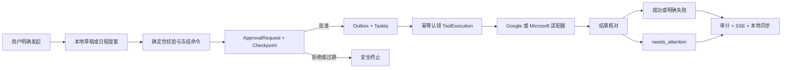

# AI Employee M2：可执行邮件与日历助手设计

> 日期：2026-08-06
>
> 状态：已批准
>
> 前置里程碑：M1「可信任务中心 + 每日办公简报」

## 1. 背景与设计结论

M1 已建立单管理员登录、Google 只读同步、每日简报、持久任务、人工审批、
LangGraph Checkpoint、Taskiq、Outbox、SSE、审计和故障恢复底座。M2 在不改变这些可信
执行不变量的前提下，引入真实邮件和日历写操作，并把 Google 与 Microsoft 作为一次完整
里程碑统一交付。

M2 的产品定位仍是「助手工作台」，不是新的邮箱或日历客户端。系统可以在对话和简报中
提出行动建议，但只有用户明确点击或下达命令后，才会创建可编辑提案和人工审批。任何真实
外部写入都必须绑定一个类型化命令、一个冻结版本、一个审批决定和一个幂等工具执行事实。

设计结论如下：

- M2 一次发布 Google 和 Microsoft 邮件、日历能力，不拆分对外发布版本。
- 采用仅面向邮件和日历的供应商无关「可信操作内核」，不引入通用 Planner 或工具平台。
- 邮件草稿只在本地加密保存，批准后直接发送；不写入供应商草稿箱。
- 每项审批只授权一个精确外部操作，有效决定窗口为 10 分钟。
- 审批使用当前安全 Cookie 会话和 CSRF，不增加密码二次验证。
- 日程修改使用供应商版本条件，补偿永远是需要新审批的新操作。
- 外部调用采用「至多产生一次业务副作用、结果必须核对」策略；只有能够证明先前写入未应用时
  才能重试调用，不确定结果不得盲目重放。
- Google 和 Microsoft 使用最小、按能力渐进取得的 OAuth 委托权限。
- M2 仍是单管理员产品，不增加多用户、租户或企业权限体系。

## 2. 范围

### 2.1 M2 包含

- Google Gmail 与 Microsoft Graph 邮件的新建、回复和全部回复。
- 本地加密邮件草稿、不可变草稿版本、编辑冲突和 10 分钟审批。
- Google Calendar 与 Microsoft Graph Calendar 非重复日程的创建和修改。
- 日程标题、时间、时区、描述、地点、参会人及邀请通知策略。
- 基于用户全部已连接日历、统一工作时间和会议缓冲的确定性冲突建议。
- 日程修改前快照，以及需要再次审批的显式恢复操作。
- Microsoft 个人账户和 Microsoft 365 工作/学校账户；不支持本地 Exchange。
- 按连接区分 `mail.read`、`mail.send`、`calendar.read`、`calendar.write` 的渐进授权。
- 连接级默认发送账户、默认日历、每周工作时间和会议缓冲设置。
- 统一操作中心、结构化审批预览、结果核对、人工结果确认和完整执行时间线。
- Microsoft 邮件、日历只读增量同步，与现有 Google 规范化模型对齐。
- Google 与 Microsoft 日历目录同步，以及每个可见日历的权限、时区和独立增量游标。
- 真实写入的幂等认领、结果核对、未知结果安全停机、审计和运维开关。

### 2.2 M2 不包含

- 供应商草稿箱同步或把未批准草稿写入 Gmail、Outlook。
- 邮件转发、附件、原始 MIME 持久化、HTML 邮件或富文本编辑器。
- Google Contacts、Microsoft Contacts 或其他通讯录同步。
- 批量邮件发送、批量日程修改或时间段授权。
- 日程删除、取消、重复日程创建或编辑、会议链接自动创建。
- 查询参会人的 Free/Busy；冲突建议只说明当前用户自己的可用性。
- 完整收件箱、邮件搜索产品、完整日历网格或供应商客户端替代品。
- Outlook 本地 Exchange、共享邮箱、Microsoft 365 Group Calendar 或应用权限访问。
- Gmail Send As 别名、Microsoft 代理发送、共享发件地址或跨邮箱委托发送。
- 文件上传、Qdrant、RAG、长期记忆、通用 Planner、工具市场、多 Agent、多用户注册或
  Kubernetes。

### 2.3 M2 发布边界

M2 必须在同一个发布版本中提供 Google 与 Microsoft 的核心能力对等。内部开发可以按可信
操作内核、Google 适配器、Microsoft 适配器和前端体验分阶段落地，但不能把只完成单一供应商
描述为 M2 发布完成。

M2 开始实施前应将根 `AGENTS.md`、README 和验收文档中的「当前只实现 M1」表述更新为
已批准的 M2 范围。该文档同步不重新打开 M1 功能范围，也不能把尚无证据的 M1 验收项标记为
已通过。

## 3. 用户控制模型

### 3.1 受控混合发起

允许以下入口生成建议：

- 每日简报中的「准备回复」或「建议调整日程」。
- 对话中的明确自然语言请求。
- 操作中心中的新邮件和新日程按钮。
- 邮件线程或日程来源详情中的显式操作按钮。

建议本身不是审批请求，也不能让任务进入 `WAITING_APPROVAL`。只有用户明确点击「准备草稿」
「创建提案」或提交自然语言命令后，应用层才创建本地草稿或日程提案。用户完成编辑并点击
「提交审批」后，系统才冻结精确命令。

### 3.2 单操作审批

一次审批只能包含以下一种操作：

- 发送一封邮件。
- 创建一个日程。
- 修改一个日程。
- 恢复一个日程到先前状态。

不允许一个审批包含多封邮件、多个日程或未来一段时间的概括授权。一个邮件可以包含多个
收件人，但总收件人数量不得超过 50 个去重地址；一个日程的参会人不得超过 50 个去重地址。
这些上限用于阻止 M2 演变为批量外联工具。

### 3.3 多账户选择

- 回复和全部回复必须绑定原始邮件连接，不能跨账户发送。
- 日程修改和恢复必须绑定原始日历连接与日历 ID。
- 新邮件使用用户默认发送账户，冻结前允许显式切换。
- 新日程使用用户默认日历，冻结前允许显式切换。
- 冻结命令必须包含精确 `connection_id` 和目标日历，执行时不得重新自动选择。
- 默认连接或默认日历已禁用、断开或失去写权限时，创建操作必须要求用户重新选择；禁止静默
  回退到另一个账户或 primary calendar。

## 4. 总体架构

M2 延续模块化单体和独立运行单元：

- FastAPI API：认证、授权、Schema、短事务和 HTTP 202 接受。
- Taskiq Worker：长任务、供应商调用、核对和补偿执行。
- Scheduler：到期审批、重试、核对扫描、保留清理和同步计划。
- PostgreSQL：连接、草稿、提案、任务、审批、工具执行、审计、Outbox 和 Checkpoint 的唯一
  真实来源。
- Redis：队列、通知、短期缓存和协调；丢失后必须从 PostgreSQL 恢复。

依赖方向保持不变：

```text
api / agents / integrations / workers
                  ↓
             application
                  ↓
               domain
```

可信操作数据流如下：



## 5. 模块与职责

### 5.1 Connections

负责：

- Google 与 Microsoft OAuth 生命周期。
- 供应商账户身份规范化。
- 实际 scope 与本地能力状态。
- 默认发送账户和默认日历。
- 能力启用、关闭和整个连接断开。

该模块不执行邮件或日历业务规则。

### 5.2 Mail

负责：

- 本地加密草稿和不可变版本。
- 新邮件、回复、全部回复的地址与线程规则。
- 纯文本正文和模型最小披露。
- 构建 `MailSendCommand`。

模型只生成正文候选，不能决定发件账户、收件人、主题、回复线程或是否发送。

### 5.3 Calendar

负责：

- 日程创建、修改和恢复提案。
- 用户本人冲突检测与候选时间生成。
- ETag、通知策略和补偿快照。
- 构建 `CalendarCreateCommand`、`CalendarUpdateCommand` 和
  `CalendarRestoreCommand`。

模型只能解释冲突与建议，不能决定候选时间是否合法。

### 5.4 Trusted Actions

负责：

- 类型化命令验证与规范序列化。
- 冻结命令、AEAD 加密和哈希绑定。
- 人工审批中断与恢复。
- 工具执行认领、结果核对和人工结果确认。
- 任务、步骤、审计、Outbox、Checkpoint 和 SSE 的一致状态变化。

该模块只接受邮件和日历命令联合，不提供任意 Tool Manifest 或动态工具注册。

### 5.5 Provider Adapters

Google 与 Microsoft 适配器分别负责：

- OAuth URL、Token 交换、刷新和撤销。
- 只读增量同步。
- 邮件发送和回复。
- 日程创建、更新及结果核对。
- 供应商错误到内部错误类别的映射。

供应商 SDK、HTTP 字段和原始响应不得离开适配器边界。

## 6. 类型化命令

### 6.1 通用要求

所有命令必须：

- 使用固定英文 `action` 和显式 `schema_version`。
- 只包含标准 JSON 类型，时间使用带时区 RFC 3339，业务日期携带 IANA 时区。
- 包含精确 `connection_id`，不得只依赖账户邮箱。
- 包含稳定 `operation_id`，供幂等、核对和供应商关联使用。
- 在进入领域层前完成 Pydantic 边界验证，再映射为不可变领域值对象。
- 规范化后计算 SHA-256；动作名、Schema 版本和完整载荷都进入哈希。

### 6.2 `MailSendCommand`

字段至少包括：

| 字段 | 约束 |
|---|---|
| `schema_version` | 固定为 `mail_send.v1` |
| `action` | 固定为 `mail.send` |
| `operation_id` | 稳定 UUID |
| `connection_id` | 已启用 `mail.send` 的连接 |
| `draft_id` / `draft_version` | 已冻结的本地草稿版本 |
| `mode` | `new`、`reply` 或 `reply_all` |
| `source_thread_id` | 回复类必填，新邮件为空 |
| `source_message_id` | 回复类必填，新邮件为空 |
| `to` / `cc` / `bcc` | 规范化、去重地址；合计不超过 50 |
| `subject` | 用户可见纯文本主题，最大 255 个 Unicode 字符 |
| `body_text` | 纯文本，最大 100,000 个 Unicode 字符 |
| `thread_headers` | 回复所需的内部规范化引用，不接受用户任意原始 Header |

发件地址从连接事实确定，不能由用户或模型在命令中伪造。地址去重忽略域名大小写，并按供应商
规范保留本地部分；系统不擅自执行 Gmail 点号或加号地址归并。

### 6.3 `CalendarCreateCommand`

字段至少包括：

| 字段 | 约束 |
|---|---|
| `schema_version` | 固定为 `calendar_create.v1` |
| `action` | 固定为 `calendar.create` |
| `operation_id` | 稳定 UUID |
| `connection_id` / `calendar_id` | 精确目标 |
| `client_event_id` | 供应商允许时使用的稳定创建标识 |
| `title` | 必填纯文本 |
| `description` / `location` | 可空纯文本 |
| `starts_at` / `ends_at` | 明确 UTC 瞬间或全天日期 |
| `timezone` | IANA 时区 |
| `all_day` | 显式布尔值 |
| `attendees` | 规范化去重地址，不超过 50 |
| `notification_policy` | `all` 或 `none` |

不允许 recurrence、conference、attachments 或任意供应商扩展字段。

### 6.4 `CalendarUpdateCommand`

在创建命令字段基础上增加：

- `provider_event_id`：目标供应商事件 ID。
- `base_etag`：生成提案时的供应商版本。
- `before_snapshot_id`：加密修改前快照。
- `changed_fields`：确定性生成的字段名集合，仅用于预览和审计，不代替完整期望状态。

执行时必须用 `base_etag` 做条件更新。供应商当前版本不同则不执行写入。

### 6.5 `CalendarRestoreCommand`

恢复命令由历史 `before_snapshot` 生成，但必须：

- 读取当前供应商事件并取得新的 `base_etag`。
- 显示当前状态与待恢复状态的完整差异。
- 冻结新的通知策略。
- 生成新的 `operation_id`、ApprovalRequest 和 ToolExecution。

恢复不能复用旧审批，也不能绕过当前能力状态。

## 7. 状态模型

### 7.1 草稿和提案

邮件草稿状态：

```text
editing → awaiting_approval → executing → sent
   ↓             ↓          ↙          ↘
cancelled      editing   editing   needs_attention
```

- `editing`：允许基于当前版本继续编辑。
- `awaiting_approval`：某一不可变版本已生成审批，草稿被锁定；继续编辑必须先撤回审批。
- `executing`：审批已通过且 Worker 已认领，不能再取消或编辑冻结版本。
- `sent`：对应发送命令已确认成功。
- `cancelled`：用户删除本地草稿，没有外部副作用。
- `needs_attention`：发送结果未知；只能核对或人工确认，不能编辑后直接重发。

拒绝、过期或显式撤回会使草稿返回 `editing`。此后首次保存产生新版本；旧 ApprovalRequest
状态变为 `invalidated`，其冻结版本永久不可再次批准。明确确认邮件未发送后，用户也必须先
产生新草稿版本并重新审批。

日程提案使用 `editing`、`awaiting_approval`、`executing`、`applied`、`stale`、
`needs_attention` 和 `cancelled`。ETag 冲突会进入 `stale`，必须基于供应商最新事件重新生成
版本，旧提案不能继续执行。

ApprovalRequest 在 M1 状态基础上增加 `invalidated`，仅用于草稿或提案版本变化、能力关闭、
连接断开或执行认领截止时间到期。`invalidated` 是终态，不能改回 pending。

### 7.2 TaskRun

M2 在 M1 状态基础上增加：

- `reconciling`：供应商可能已接收写请求，系统只执行只读核对。
- `needs_attention`：自动核对无法确定结果，禁止继续写入。

主要迁移：

```text
running → waiting_approval → queued → running
running → retry_scheduled → queued
running → reconciling → succeeded
running → reconciling → failed
running → reconciling → needs_attention
needs_attention → reconciling
needs_attention → succeeded
needs_attention → failed
```

`needs_attention → succeeded/failed` 只允许经过用户人工结果确认用例，并追加明确 actor、时间和
确认来源。它不能重新调用供应商。

### 7.3 ToolExecution

工具执行状态：

```text
claimed → executing → succeeded
                    → confirmed_failed
                    → retryable_failed → executing
                    → reconciling → succeeded
                                  → confirmed_failed
                                  → needs_attention
```

- `claimed` 已阻止第二个 Worker 创建同一执行事实。
- `executing` 表示请求即将发送或正在发送，不能据此推断供应商结果。
- `retryable_failed` 只用于适配器能够证明供应商未接受写入的失败。
- `reconciling` 和 `needs_attention` 期间不得重发写请求。

## 8. 审批协议

### 8.1 冻结与存储

真实命令不得明文存入 `ApprovalRequest.payload`。ApprovalRequest 扩展为：

- `action`、`schema_version`、风险等级和不含敏感内容的预览元数据。
- 完整规范命令的 AEAD `ciphertext`、`nonce` 和 `key_version`。
- 规范明文命令的 `payload_hash`。
- 草稿或日程提案 ID 与版本。
- `expires_at`、`approved_execution_deadline_at` 和现有决定字段。

审批预览和 Worker 执行时才在受控内存中解密完整命令。日志、SSE、审计和普通错误不得输出
解密命令。

### 8.2 决定规则

- 待审批决定窗口为创建后 10 分钟。
- 当前有效登录会话和 CSRF 即可决定，不要求密码二次验证。
- 决定必须携带当前 `version` 和 `payload_hash`。
- 编辑已提交草稿或提案必须先使旧审批失效，再产生新版本。
- 已批准操作必须在批准后 5 分钟内由 Worker 完成幂等认领；超时则安全失败并要求重新审批。
- 认领后即使超过执行截止时间，也必须完成结果核对，不能把可能已执行的调用当作未执行。
- 连接断开、能力关闭或载荷变化会阻止尚未认领的操作。

### 8.3 审批预览

邮件预览必须展示：

- 供应商、账户、全部 To/CC/BCC。
- 新邮件、回复或全部回复模式。
- 完整主题和纯文本正文。
- 不可撤销提示、版本、到期时间和风险等级。

日程预览必须展示：

- 供应商、账户、目标日历。
- 创建、修改或恢复类型。
- 修改前后字段差异、时区、参会人和通知策略。
- 当前检测到的冲突、ETag 版本和可补偿性说明。

前端不能只显示原始 JSON。

### 8.4 风险等级

M2 风险等级只影响预览、审计和指标，不改变「每次写入都要审批」的规则：

- `high`：所有邮件发送；带参会人或发送通知的日程创建、修改和恢复。
- `medium`：不含参会人且 `notification_policy=none` 的个人日程创建、修改和恢复。

M2 没有可以免审批的低风险外部写操作。用户已选择不进行密码二次验证，因此两类风险都使用
当前安全会话、CSRF、10 分钟决定窗口和精确载荷校验。

## 9. 邮件助手

### 9.1 草稿生成

模型输入只包含：

- 用户本次指令。
- M1 已有线程摘要。
- 最近最多 3 封与回复直接相关的已清洗正文。
- 清洗后正文合计最多 12,000 个 Unicode 字符。
- 明确的语气、语言和长度要求。

模型输入继续删除签名、历史重复引用、跟踪内容和明显敏感模式。垃圾邮件正文不发送给模型。
Prompt 使用版本文件 `mail_draft_v1.md`，模型输出只包含正文候选；地址、主题和线程字段由应用层
确定性处理。

模型不可用或输出验证失败时，用户仍可创建空白本地草稿并手工编辑。系统不得把模型失败伪装成
发送失败。

### 9.2 草稿编辑

- 正文仅支持纯文本和换行，不解释 Markdown 或 HTML。
- 每次成功保存生成单调递增版本。
- PATCH 必须携带当前版本，陈旧版本返回 409。
- 自动补全只使用本地已同步历史参与者，不调用供应商 Contacts API。
- 用户可以输入任意语法合法地址；地址验证失败时不能提交审批。
- 回复和全部回复的原始线程、发送连接和确定性回复主题不可改变；需要更改主题时必须转换为
  新邮件。
- 发件地址固定为连接主账户；不解析或使用 Gmail Send As、Microsoft 代理发送或共享邮箱别名。
- 回复全部默认排除用户自己的连接地址并对地址去重，用户冻结前可以调整 To/CC/BCC。

### 9.3 Gmail 发送

- 使用 `gmail.send` scope 和 `users.messages.send`。
- 生成 RFC 2822 纯文本 MIME，并进行 Base64URL 编码。
- 回复必须提供原始 `threadId`、匹配主题，以及符合 RFC 2822 的 `In-Reply-To` 和
  `References`。
- 不调用 Gmail Draft API。
- 使用稳定 Message-ID 或等价关联信息进行 Sent 结果核对；若供应商无法证明结果，进入
  `needs_attention`。

### 9.4 Microsoft Graph 发送

- 使用委托 `Mail.Send`，不为本地草稿申请 `Mail.ReadWrite`。
- 新邮件使用直接发送接口；回复和全部回复使用对应的直接发送语义。
- 正文 ContentType 固定为 Text，并保存到 Sent Items。
- 使用 Graph 请求标识、支持的自定义关联信息和 Sent Items 只读查询进行核对。
- 若直接回复接口不能无损表达冻结命令，适配器必须在审批前拒绝，不得创建隐藏供应商草稿或
  丢弃收件人字段。

### 9.5 邮件结果

成功结果至少保存：

- 供应商消息 ID、线程或会话 ID。
- 供应商请求关联标识。
- 发送确认时间。
- 不含正文和完整地址的结果摘要。
- 可打开的供应商 Sent Items 链接；无法生成时明确为空。

邮件发送成功后不可补偿。界面不得提供「撤回」或暗示可撤回的按钮。

## 10. 日历助手

### 10.1 工作时间与冲突建议

用户设置新增：

- 每周工作时间：一周中的每一天可包含零个或多个不重叠时间段。
- 工作时区：复用用户 IANA 时区。
- 会议缓冲：0～120 分钟，默认 10 分钟。

迁移默认工作时间为周一至周五 09:00～18:00。用户修改后立即用于新建议，不追溯修改已冻结
提案。

确定性建议算法：

1. 读取用户全部已连接且同步新鲜的日历事件。
2. 把事件按用户 IANA 时区映射到工作时间。
3. 在事件前后加入配置的缓冲。
4. 按 15 分钟网格搜索未来 14 天。
5. 返回最多 3 个满足原始时长的候选时间。
6. 不查询参会人 Free/Busy，也不声称参会人可用。

若任一连接同步陈旧或失败，候选结果必须标记完整性为 partial，并展示缺失账户。模型只生成
解释文字，不能修改候选时间。

### 10.2 创建日程

- 支持定时和全天非重复事件。
- 有参会人的事件默认 `notification_policy=all`。
- 无参会人的个人事件默认 `notification_policy=none`。
- 用户冻结前可以显式更改通知策略。
- Google `sendUpdates=none` 可能影响外部日历同步，审批预览必须显示供应商警告。
- 创建使用稳定 `operation_id` 映射到供应商支持的事件关联标识，降低重复 POST 风险。
- 目标日历必须来自已同步日历目录，且供应商访问角色明确允许创建事件。

### 10.3 修改日程

- 只允许修改非重复事件；发现 recurring master 或 instance 时返回稳定不支持错误。
- 提案生成时保存 `base_etag` 和加密 before snapshot。
- 目标事件和日历必须在供应商目录中明确标记为当前账户可修改。
- 执行前读取当前事件并比较版本；不同则返回冲突，不调用更新接口。
- 时间、地点或参会人变化默认发送更新通知；纯个人字段变化默认不发送，冻结前可调整。
- 更新必须提交完整期望状态或供应商安全 Patch，不能依赖未展示的供应商默认值。

### 10.4 恢复日程

恢复是新提案而不是数据库回滚：

1. 读取历史修改前快照。
2. 读取供应商当前事件与 ETag。
3. 计算当前状态到历史状态的差异。
4. 用户确认通知策略并提交新审批。
5. 使用新 ETag 条件更新。

若事件已删除、成为重复事件或用户不再拥有修改权限，恢复提案不可执行并显示明确原因。

## 11. OAuth、连接与权限

### 11.1 能力模型

每个连接为下列能力保存独立状态：

- `mail.read`
- `mail.send`
- `calendar.read`
- `calendar.write`

能力状态为：

- `disabled`：用户未启用或已本地关闭。
- `authorizing`：正在进行渐进 OAuth。
- `enabled`：本地启用且最近一次验证存在所需 scope。
- `degraded`：Token 可用但供应商调用持续失败。
- `action_required`：需要重新授权或管理员同意。
- `revoked`：供应商明确撤销。

创建提案、提交审批和 Worker 执行三个边界都必须检查能力；前端隐藏按钮不是授权。

能力依赖固定为：

- `mail.send` 依赖 `mail.read`，因为回复线程绑定和 Sent 结果核对需要读取能力。
- `calendar.write` 依赖 `calendar.read`，因为冲突、ETag 和写后核对需要读取能力。
- 对应写能力启用期间不能单独关闭其读取能力；必须先关闭写能力。

### 11.2 Google scope

基础身份：

- `openid`
- `email`

邮件读取能力：

- `https://www.googleapis.com/auth/gmail.readonly`

日历读取能力：

- `https://www.googleapis.com/auth/calendar.readonly`

邮件发送能力追加：

- `https://www.googleapis.com/auth/gmail.send`

日历写能力追加：

- `https://www.googleapis.com/auth/calendar.events`

### 11.3 Microsoft delegated scope

基础身份和离线访问：

- `openid`
- `profile`
- `email`
- `offline_access`

读取能力：

- `Mail.Read`
- `Calendars.Read`

邮件发送能力：

- `Mail.Send`

日历写能力：

- `Calendars.ReadWrite`

Microsoft OAuth 使用允许个人 Microsoft 账户和工作/学校账户的端点。连接唯一身份由供应商、
tenant/account 类型和 Graph 用户 ID 共同规范化，不能只使用邮箱。

### 11.4 渐进授权

- 首次连接允许只申请读取能力。
- 新连接由用户选择邮件读取、日历读取或两者；不得强制申请未选择的数据源权限。
- 用户启用某一写能力时重新发起 OAuth，并请求当前已启用能力的并集。
- 回调后必须以实际返回 scope 更新能力；缺失 scope 的能力进入 `action_required`。
- Token 响应没有新 refresh token 时保留仍有效的既有加密 refresh token，不能写空覆盖。
- Microsoft 租户要求管理员同意时，界面显示稳定错误和管理员操作说明。

Google `calendar.events` 和 Microsoft `Calendars.ReadWrite` 都是比 M2 动作集合更粗的供应商
权限，技术上可能允许删除事件。应用层端口、类型化命令联合和审批 Schema 不暴露删除动作；
供应商 scope 较粗不能成为扩大产品权限的理由。

### 11.5 关闭能力与断开连接

关闭单项能力：

- 本地立即阻止新提案。
- 取消尚未认领的相关审批和任务。
- 已认领执行进入核对，不能伪装为已取消。
- 不承诺供应商远端已删除单一 scope；彻底缩减权限需要断开并重新连接。

断开整个连接：

- 先删除本地 Token 密文并标记连接断开。
- 尽力调用供应商 revoke。
- 取消尚未认领的所有相关任务。
- 保留符合周期的历史结果和不含敏感内容的审计。

## 12. Microsoft 增量同步

### 12.1 邮件

- 初始读取最近 7 天的可访问邮件，排除 Deleted Items 和 Junk Email，并确保覆盖 Sent Items。
- 使用 Microsoft Graph Delta 保存每个资源的 `deltaLink`。
- 规范化 Graph message ID、conversation ID、internetMessageId、参与者、主题、正文、时间、
  分类和 webLink。
- 原始 Graph JSON、附件和完整 MIME 不持久化。
- Delta 失效时清除游标并执行受限 7 天重新同步。

### 12.2 日历

- 先同步用户可见日历目录，规范化日历 ID、名称、时区、primary 标记、访问角色、可写能力和
  provider URL。
- 初始读取用户时区下过去 1 天至未来 30 天的事件窗口，与 M1 Google 行为保持可比。
- Google Sync Token 和 Microsoft Calendar View Delta 都按单个日历保存，不能用连接级游标覆盖
  多个日历。
- 规范化事件 ID、日历 ID、ETag/changeKey、时间、时区、参会人、状态和 webLink。
- 重复和会议字段可以读取并展示，但 M2 写提案必须拒绝不支持的重复事件修改。

### 12.3 数据模型对齐

现有 `EmailThread`、`EmailMessage` 和 `CalendarEvent` 继续以
`connection_id + provider_object_id` 唯一。所有硬编码 `provider == "google"` 的共享查询必须
改为通过连接类型和供应商适配器选择，不能复制第二套 Microsoft 领域模型。

## 13. 幂等、结果核对与补偿

### 13.1 幂等认领

每个 ToolExecution 的幂等键由以下事实组成：

```text
action + task_id + approval_id + approval_version + operation_id
```

数据库唯一约束先于供应商调用提交。重复 Worker 若看到：

- `succeeded`：复用标准化结果。
- `confirmed_failed`：复用明确失败。
- `retryable_failed`：按持久策略重新尝试同一执行。
- `claimed`、`executing` 或 `reconciling`：不得写入，只能核对。
- `needs_attention`：停止并等待用户处理。

### 13.2 安全重试

只有以下情况允许自动重试写请求：

- DNS、连接建立或本地序列化在请求可能发送前失败。
- 供应商以有文档保证的响应明确拒绝且未创建资源。
- 核对接口能够权威证明操作未应用。

请求发送后的超时、连接中断和语义不明确的 5xx 必须先核对。适配器返回内部
`ProviderWriteOutcome`，明确区分 `confirmed_applied`、`confirmed_not_applied` 和 `unknown`；
应用层不得根据普通异常字符串猜测。

### 13.3 核对

核对使用只读能力和稳定关联信息：

- Gmail：Sent 中的供应商消息 ID、线程、Message-ID 或等价关联条件。
- Microsoft Mail：请求关联标识、Sent Items 和可验证邮件属性。
- Google Calendar：客户端事件 ID、目标日历和事件资源。
- Microsoft Calendar：操作关联标识、事件 ID 和版本信息。

核对采用有界持久重试，默认 1、5、30、120 秒共四次。仍不能确定则进入
`needs_attention`。

### 13.4 人工结果确认

`needs_attention` 页面允许：

- 重新运行只读核对。
- 打开供应商对应位置。
- 记录「已执行」或「未执行」。

人工结论必须记录 user、时间、ToolExecution、枚举结果原因和供应商检查入口。接口不接受
可能包含正文或地址的自由文本说明。确认「未执行」不会自动重发；用户必须克隆为新提案并
重新审批。

### 13.5 撤销与补偿

- 撤销连接或能力只取消尚未认领的操作。
- 邮件发送没有补偿操作。
- 日程修改成功后可生成恢复提案。
- 日程恢复若遇到版本变化、权限变化或目标不存在必须拒绝。
- 自动补偿禁止用于覆盖供应商中的后续合法修改。

## 14. 数据模型与迁移

### 14.1 新实体

| 实体 | 关键字段与约束 |
|---|---|
| `connection_capabilities` | `user_id`、`connection_id`、`capability` 唯一；状态、实际 scope、验证时间、错误码 |
| `provider_calendars` | `connection_id + provider_calendar_id` 唯一；名称、时区、primary、访问角色、可写状态和 provider URL |
| `mail_drafts` | `user_id`、`connection_id`、源线程、当前版本、状态、保留截止时间 |
| `mail_draft_versions` | `draft_id + version` 唯一；地址与主题元数据、正文 AEAD 三元组、Prompt/模型版本 |
| `calendar_change_proposals` | 用户、连接、日历、操作类型、目标事件、基础 ETag、版本、状态 |
| `calendar_change_snapshots` | 提案归属、内容 AEAD 三元组、规范哈希、保留截止时间 |

所有用户域实体直接包含非空 `user_id`，并用组合外键防止跨用户、跨连接归属错配。

现有 CalendarEvent 增加规范化 organizer、attendees、访问角色或 `can_edit` 投影。同步游标新增
非空 `scope_key`，唯一键扩展为 `connection_id + resource_kind + scope_key`：邮箱使用稳定 mailbox
或 folder key，日历使用 provider calendar ID。迁移期间现有 Google 游标回填到明确的 primary
calendar scope，不能丢失原同步位置。

### 14.2 扩展实体

`ApprovalRequest` 增加：

- `schema_version`
- `risk_level`
- `payload_ciphertext`
- `payload_nonce`
- `payload_key_version`
- `proposal_kind`
- `proposal_id`
- `proposal_version`
- `approved_execution_deadline_at`

M1 假写记录允许在迁移期保留原 JSONB payload；所有 M2 真实命令必须使用加密列。读取路径按
`schema_version` 明确区分，不能静默回退到明文。

现有非空 JSONB `payload` 列在 M2 保留。M2 记录只写入不含敏感内容的存储标记和 Schema
版本，例如 `{"storage":"encrypted","schema_version":"mail_send.v1"}`；完整命令只存在于
AEAD 列。加密 AAD 至少绑定 `user_id`、ApprovalRequest ID、action 和 schema_version，防止
跨用户、跨记录替换密文。

`ToolExecution` 增加：

- `operation_id`
- `provider`
- `provider_resource_id`
- `provider_request_id`
- `correlation_id`
- `claimed_at`、`request_started_at`、`completed_at`
- `reconciliation_attempt_count`、`last_reconciled_at`
- `manual_resolution`、`manual_resolved_by_user_id`、`manual_resolved_at`

`User` 或 `UserSettings` 增加：

- 默认邮件连接。
- 默认日历连接与日历 ID。
- 类型化每周工作时间。
- 会议缓冲分钟数。

### 14.3 迁移策略

1. 只增加新表、新列、新索引和新状态值。
2. 为现有 Google 连接根据已保存 scope 回填读取能力，写能力统一为 disabled。
3. 先让代码兼容旧审批数据，再切换 M2 写入路径。
4. 将共享 Repository 的 Google 常量过滤改为显式供应商参数。
5. M2 不删除旧列，不依赖破坏性 downgrade。

## 15. API 与 SSE

### 15.1 邮件草稿 API

| 方法 | 路径 | 行为 |
|---|---|---|
| `GET` | `/api/v1/mail/drafts` | 分页列出当前用户草稿 |
| `POST` | `/api/v1/mail/drafts` | 创建空白或源线程草稿，返回 201 |
| `GET` | `/api/v1/mail/drafts/{id}` | 返回解密后的当前草稿视图 |
| `PATCH` | `/api/v1/mail/drafts/{id}` | 携带版本更新并创建新版本 |
| `DELETE` | `/api/v1/mail/drafts/{id}` | 取消未发送本地草稿 |
| `POST` | `/api/v1/mail/drafts/{id}/generate` | 创建异步模型草拟任务，返回 202 |
| `POST` | `/api/v1/mail/drafts/{id}/submit` | 冻结当前版本并返回 202 与 task_id |

### 15.2 日程提案 API

| 方法 | 路径 | 行为 |
|---|---|---|
| `GET` | `/api/v1/calendar/proposals` | 分页列出提案 |
| `POST` | `/api/v1/calendar/proposals` | 创建日程创建或修改提案 |
| `GET` | `/api/v1/calendar/proposals/{id}` | 返回当前提案及冲突结果 |
| `PATCH` | `/api/v1/calendar/proposals/{id}` | 携带版本更新并重新计算冲突 |
| `DELETE` | `/api/v1/calendar/proposals/{id}` | 取消未执行提案 |
| `POST` | `/api/v1/calendar/proposals/{id}/suggest-times` | 在短事务外同步计算并返回 200 与确定性候选 |
| `POST` | `/api/v1/calendar/proposals/{id}/submit` | 冻结当前版本并返回 202 |
| `POST` | `/api/v1/calendar/events/{id}/restore-proposal` | 从历史快照创建恢复提案 |

### 15.3 操作与连接 API

| 方法 | 路径 | 行为 |
|---|---|---|
| `GET` | `/api/v1/actions` | 统一列出草稿、提案和执行状态 |
| `GET` | `/api/v1/actions/{task_id}` | 返回可信操作快照 |
| `POST` | `/api/v1/actions/{task_id}/reconcile` | 对 unknown 结果创建只读核对任务 |
| `POST` | `/api/v1/actions/{task_id}/manual-resolution` | 记录用户检查后的结果 |
| `GET` | `/api/v1/connections/{id}/capabilities` | 返回实际 scope 与能力状态 |
| `POST` | `/api/v1/connections/{id}/capabilities/{capability}/enable` | 返回渐进授权 URL |
| `POST` | `/api/v1/connections/{id}/capabilities/{capability}/disable` | 本地关闭能力并取消未认领任务 |

所有修改请求需要当前 Cookie 会话和 CSRF。草稿与提案保存为短事务；模型生成、提交、写入、
核对和隐私删除等长任务返回 HTTP 202。

`manual-resolution` 只接受 `confirmed_executed` 或 `confirmed_not_executed` 枚举、当前任务版本
和 CSRF，不接受自由文本证据；提交前 UI 必须再次说明该决定不会调用供应商。

### 15.4 SSE 事件

现有任务 SSE 增加以下持久事件：

- `action.submitted`
- `approval.invalidated`
- `tool.claimed`
- `tool.reconciling`
- `tool.needs_attention`
- `tool.manually_resolved`

事件 payload 只包含 ID、状态、版本、错误码和脱敏摘要，不包含地址、主题、正文、日程标题、
描述或完整参会人列表。旧前端遇到未知事件必须忽略并回退任务快照。

草稿、提案和连接能力在创建任务前没有 `task_id`，因此不为它们新增第二套用户级 SSE。它们的
创建、编辑和能力变更以 REST 响应为准，操作中心在重新聚焦或恢复连接时重新拉取列表。

所有返回草稿、审批完整预览或日程敏感内容的响应必须设置 `Cache-Control: no-store`。前端不得
把这些响应写入 localStorage、sessionStorage、URL、console 或持久离线缓存。

## 16. 前端体验

### 16.1 操作中心

新增 `/actions` 页面，包含：

- 邮件草稿。
- 日程提案。
- 待审批。
- 正在执行或核对。
- 需要人工确认。
- 已完成历史。

该页面是统一投影，不成为第二份状态来源；刷新后从 API 和任务快照恢复。

### 16.2 邮件编辑器

- 展示供应商、发送账户和固定回复线程。
- 支持 To、CC、BCC、主题和纯文本正文。
- 显示模型生成中、生成失败、保存冲突和草稿版本。
- 提交审批前显示收件人数和不可撤销提示。
- 不提供附件、HTML、富文本或供应商草稿同步入口。

### 16.3 日程编辑器

- 展示账户、目标日历、IANA 时区和完整字段。
- 展示当前冲突、工作时间外警告和最多三个候选时间。
- 展示参会人和通知策略。
- 修改任一时间字段后使旧冲突结果失效并重新计算。
- 修改或恢复时展示前后差异及 ETag 冲突。

### 16.4 审批卡片

按命令类型展示结构化预览，不使用通用 JSON `<pre>` 作为正式体验。批准和拒绝期间禁用重复
提交；过期、版本变化、哈希冲突和能力撤销统一展示可执行恢复动作。

### 16.5 `needs_attention`

页面提供：

- 当前核对尝试和最后错误。
- 供应商检查链接。
- 「重新核对」「确认已执行」「确认未执行」。
- 明确警告：确认未执行不会自动重发。

所有交互支持键盘、可见焦点、程序化 label、状态 live region 和窄屏布局。

## 17. 安全、隐私与保留

### 17.1 安全边界

- 所有外部写必须通过 API 权限、连接能力和精确审批三层校验。
- 审批不使用密码二次验证，因此会话 Cookie、CSRF、会话撤销、Secure、HttpOnly 和 SameSite
  属性是强制边界。
- Provider Token 继续使用带版本 AEAD；明文只存在于受控内存。
- M2 命令、邮件正文、日程描述、地点和补偿快照使用字段或记录级 AEAD。
- 地址、主题和参会人不得进入日志、指标 label、Trace attribute 或 URL query。
- 正式与开发默认不允许真实写入；显式运行开关和连接能力缺一不可。

### 17.2 保留

复用现有用户设置：

| 数据 | 默认周期 | 到期处理 |
|---|---:|---|
| 邮件草稿正文与邮件审批正文 | 30 天 | 清除 AEAD 三元组，保留哈希和脱敏结果 |
| 邮件草稿元数据与操作摘要 | 180 天 | 删除或最小化元数据 |
| 日程内容与补偿快照 | 事件结束后 180 天 | 清除内容密文 |
| Task、状态与不含内容的审计 | 365 天 | 按现有工作区历史清理 |
| OAuth 凭据 | 连接期间 | 断开时删除本地密文并尽力撤销 |

未发送草稿按最后编辑时间应用邮件正文周期。正文到期后，草稿不可再次提交，但可以保留一个
不含内容的历史占位。

### 17.3 删除能力

- 清除邮箱缓存：取消并删除依赖对应线程且尚未认领的草稿和审批；已认领操作保留最小执行与
  核对事实，不能因删除来源缓存而伪装成未执行。
- 清除日历缓存：取消对应且尚未认领的提案和恢复操作；已认领操作按相同规则保留最小事实。
- 从零创建且未引用源数据的本地草稿不随来源缓存删除。
- 删除全部数据：先建立用户级写入屏障，取消未认领操作，并对已认领操作执行一次有界核对；
  随后删除连接、草稿、提案、任务内容、密文和 provider IDs。即使结果仍未知也必须完成本地
  删除，但应在删除前向用户明确提示外部副作用可能已经发生，并只保留不含个人内容的删除审计。

## 18. 错误契约

新增稳定错误码至少包括：

| 错误码 | HTTP/任务语义 |
|---|---|
| `connection_capability_disabled` | 409，用户需启用能力 |
| `connection_scope_missing` | 409，用户需重新授权 |
| `microsoft_admin_consent_required` | 409，组织管理员操作 |
| `draft_version_conflict` | 409，重新加载草稿 |
| `proposal_version_conflict` | 409，重新加载提案 |
| `approval_invalidated_by_edit` | 409，提交新版本 |
| `approval_execution_deadline_expired` | 409/任务失败，重新审批 |
| `mail_recipient_limit_exceeded` | 422，减少地址 |
| `mail_thread_binding_conflict` | 409，源线程已变化或不可访问 |
| `calendar_event_version_conflict` | 409，基于最新事件重新提案 |
| `calendar_recurring_event_unsupported` | 422，不支持的 M2 操作 |
| `calendar_notification_mapping_unsupported` | 422，供应商不能无损映射 |
| `provider_write_outcome_unknown` | 任务进入 `needs_attention` |
| `provider_reconciliation_failed` | 保留真实未知状态 |
| `manual_resolution_conflict` | 409，结果已被其他事实收敛 |

Problem Details 不返回供应商原始响应、完整地址或正文。未知异常仍映射为内部错误并保留 trace_id。

## 19. 可观测性与运维

新增指标：

- `provider_write_requests_total{provider,action,outcome}`
- `approval_decisions_total{action,decision}`
- `approval_expired_total{action}`
- `tool_reconciliation_total{provider,action,outcome}`
- `tool_reconciliation_age_seconds{provider,action}`
- `needs_attention_tasks{provider,action}`
- `calendar_version_conflicts_total{provider}`
- `connection_capability_state{provider,capability,state}`
- `write_kill_switch_state{provider}`

指标 label 不允许 account、地址、主题、日程标题或 task_id 等高基数字段。

必须告警：

- `needs_attention` 超过 15 分钟。
- 同一幂等键出现第二次供应商调用企图。
- 写入开关配置与运行时适配器状态不一致。
- OAuth 撤销失败持续积压。
- 核对扫描器或 Outbox relay 停止心跳。

运行手册新增：

- Google/Microsoft 权限升级与重新授权。
- Microsoft 管理员同意故障处理。
- 全局和供应商写入停机开关。
- 未知结果人工核对。
- 日程恢复和冲突处理。
- 疑似误发、重复发送或未审批写入的事故响应。

## 20. 测试策略

### 20.1 单元测试

- 命令 Schema、规范序列化与跨进程稳定哈希。
- 地址解析、去重、回复和全部回复规则。
- 草稿、提案、Task、Approval 和 ToolExecution 状态迁移。
- 能力启用、关闭、断开和执行时复核。
- 工作时间、DST、全天事件、缓冲和候选时间算法。
- ETag、before snapshot 和恢复规则。
- ProviderWriteOutcome 与重试安全判断。
- 模型输入裁剪、签名清洗和输出 Schema。

### 20.2 数据库与队列集成测试

- 所有迁移、约束、用户隔离和 AEAD AAD 归属。
- 同一草稿并发更新和旧版本提交。
- 编辑后旧审批失效。
- 重复审批决定、过期和执行截止时间。
- 两个 Worker 竞争同一工具执行。
- 崩溃点：认领前、认领后请求前、请求后结果提交前、结果提交后队列确认前。
- Redis 清空、Outbox 重投、Checkpoint 恢复和 SSE 重放。
- 能力在等待审批、排队和执行期间被关闭。
- `needs_attention` 核对和人工结论竞争。
- 日程修改与恢复的 ETag 竞争。

### 20.3 供应商契约测试

Google 与 Microsoft 分别覆盖：

- OAuth state、PKCE、渐进 scope、刷新、撤销和缺失 scope。
- 初始同步、Delta/History、分页、游标失效和删除墓碑。
- 邮件发送、新回复、全部回复和 Sent 核对。
- 日程创建、修改、通知策略、ETag 和稳定关联标识。
- 401 刷新、403 权限、429 Retry-After、5xx、超时和未知结果。
- Microsoft 个人账户与工作/学校账户响应差异。

CI 使用 HTTP mock 和脱敏 fixture，不访问真实供应商。

### 20.4 前端与 E2E

- 草稿编辑、版本冲突、模型失败和本地恢复。
- 日程冲突、候选时间和通知预览。
- 结构化审批、拒绝、过期、修改失效和 409。
- 断线、刷新、乱序/重复 SSE 和快照兜底。
- `reconciling`、`needs_attention` 和人工结论。
- 连接能力渐进授权和管理员同意错误。
- 键盘、焦点、live region 和移动布局。

自动 E2E 使用 Fake provider。一次发布前人工 E2E 只使用专用 Google 与 Microsoft 测试账户和
合成数据。

### 20.5 模型评测

邮件草稿评测集使用合成线程，至少验证：

- 回答了明确问题且没有虚构承诺。
- 未改变收件人、主题或线程事实。
- 不复制签名、跟踪信息或不相关历史。
- 在上下文不足时表达不确定，不伪造日期、金额或决定。
- Prompt 版本、模型名、输入哈希和结构化结果可追踪。

## 21. 验收标准

### 21.1 功能

- Google 与 Microsoft 都能只读同步并完成新邮件、回复、全部回复。
- Google 与 Microsoft 都能创建和修改非重复日程。
- 本地草稿编辑、版本、提交、拒绝、过期和发送结果可恢复。
- 冲突建议遵循用户全部连接、工作时间、时区和缓冲。
- 日程恢复始终产生新审批。
- 操作中心从 PostgreSQL 快照恢复全部非临时状态。

### 21.2 可信执行

- 无有效能力、审批版本和匹配哈希时，供应商写调用次数为零。
- 重复队列投递和 Graph 恢复本身不能产生第二次写调用；只有适配器能够证明先前调用未应用时，
  持久重试策略才允许再次调用。
- 写请求结果未知时不能自动重发。
- 每个写入都有唯一 ToolExecution、供应商关联事实和追加审计。
- 编辑草稿或提案后，旧审批必定失败。
- 撤销能力或连接后，尚未认领操作不会执行。

### 21.3 可靠性

- Worker 在所有指定崩溃点都能恢复到成功、明确失败或 `needs_attention`，不伪造结果。
- Redis 丢失不丢失草稿、提案、任务、审批或工具结果。
- ETag 冲突不会覆盖供应商中的并发修改。
- 同步游标失效能够受限回退，不扩大数据读取窗口。

### 21.4 安全与隐私

- OAuth scope 与能力矩阵一致，不请求 Contacts、Gmail Draft 或 Mail.ReadWrite。
- Token、真实命令、正文和日程敏感字段按规格加密。
- 日志、Trace、指标、SSE 和 fixture 不包含敏感内容。
- 所有修改 API 通过会话、CSRF、用户隔离和版本验证。
- 保留和删除任务覆盖 M2 新实体及密文三元组。

### 21.5 发布门禁

M2 采用以下已批准门禁，不要求 7 天或 14 天持续试用：

1. `just ci` 全部通过并保存本轮完整输出摘要。
2. 安全 scope 审核、日志脱敏扫描和迁移验证通过。
3. 专用 Google 测试账户完成新邮件、回复、全部回复、日程创建、修改和恢复。
4. 一个专用 Microsoft 测试账户完成同等流程；另一账户类型至少通过完整 OAuth、同步和写入
   契约 fixture，且个人与工作/学校账户都必须包含在自动化契约矩阵中。
5. 审计证明每项真实测试写入都绑定有效审批和唯一 ToolExecution。
6. 完成一次部署、加密备份恢复和 Worker 调用后崩溃演练。

不执行持续试用会降低发现供应商偶发行为和长期 Token 问题的概率，这是明确接受的 M2 发布
风险；自动化重复投递和崩溃测试仍不可省略。

## 22. 部署与运行开关

外部写入必须同时满足三层开关：

- 全局外部写入开关。
- Google 或 Microsoft 供应商开关。
- 连接级能力状态。

任何一层关闭都阻止新写任务，并使尚未认领的相关审批失效。已认领操作只能完成核对。
`APP_TEST_MODE` 只能注入 Fake 适配器。专用测试账户真实 API 验证使用独立环境、显式写入开关
和账户允许列表；测试环境不得因误配连接其他账户。

部署顺序：

1. 生成加密备份并执行向前兼容迁移。
2. 部署默认关闭外部写入的新代码。
3. 验证 M1 登录、同步、简报、审批假工具和任务恢复。
4. 只为允许列表中的专用测试账户启用供应商写入。
5. 完成人工 E2E 与审计检查。
6. 打开正式环境供应商开关；每个连接仍需用户单独渐进授权。

回滚应用镜像时，新表和列保留。旧 M1 版本不得读取 M2 加密命令或把新任务状态解释为普通
失败；因此只有在所有 M2 任务均为终态时才允许回滚到 M1 代码。若仍有 `reconciling` 或
`needs_attention`，应部署保留 M2 Schema 和核对能力的修复镜像，而不是直接回滚。

## 23. 主要风险与控制

| 风险 | 控制 |
|---|---|
| 邮件发送结果未知导致重复发送 | 先持久认领、禁止盲重试、Sent 核对、`needs_attention` |
| 会话被短暂接管后批准写入 | Secure/HttpOnly/SameSite、CSRF、10 分钟决定窗口、5 分钟认领窗口、会话撤销 |
| 多账户选择错误 | 回复绑定原连接、新建使用可切换默认值、审批展示精确账户 |
| 日程并发修改被覆盖 | 基础 ETag、执行前重读、条件更新、冲突后重新提案 |
| 日程通知行为不一致 | 通知策略进入冻结载荷、适配器无损映射，不支持即审批前拒绝 |
| Microsoft 个人与企业授权差异 | `common` 类委托授权、tenant/account 规范身份、管理员同意状态 |
| 通用抽象扩大到 M5 | 命令联合只允许四个 M2 动作，不提供动态工具注册或 Planner |
| 敏感审批载荷明文落库 | 完整命令 AEAD、哈希绑定、受控内存解密、内容保留清理 |
| 无持续试用遗漏偶发问题 | 强化故障注入、两家专用账户人工 E2E、明确接受残余风险 |

## 24. 开源与官方文档参考

M2 供应商行为以实施时的官方文档和契约测试为准，当前设计参考：

- [Gmail API sending guide](https://developers.google.com/workspace/gmail/api/guides/sending)
- [Gmail threads guide](https://developers.google.com/workspace/gmail/api/guides/threads)
- [Google Calendar create events](https://developers.google.com/workspace/calendar/api/guides/create-events)
- [Google Calendar events.insert](https://developers.google.com/workspace/calendar/api/v3/reference/events/insert)
- [Microsoft Graph permissions reference](https://learn.microsoft.com/graph/permissions-reference)
- [Microsoft Graph sendMail](https://learn.microsoft.com/graph/api/user-sendmail)
- [Microsoft Graph message delta](https://learn.microsoft.com/graph/delta-query-messages)
- [Microsoft Graph calendarView delta](https://learn.microsoft.com/graph/delta-query-events)

供应商文档变化不得静默改变 scope、数据流向或写入语义。若官方能力无法满足本文冻结命令和
结果核对要求，必须先修订规格，而不是在适配器中弱化安全保证。

## 25. 设计完成条件

本规格已经明确 M2 的产品边界、用户控制、架构、命令 Schema、任务和工具状态、审批、邮件、
日历、OAuth、Microsoft 同步、幂等、核对、补偿、数据模型、API/SSE、前端、安全、保留、
错误、可观测性、测试、验收、部署和主要风险。

书面规格经用户复核批准后，下一步应创建独立的任务级 M2 实施计划。实施计划必须按测试驱动
方式拆分迁移、可信操作内核、Google、Microsoft、前端和发布证据，不得直接沿用 M1 计划或在
同一任务中同时修改多个高风险供应商写路径。
